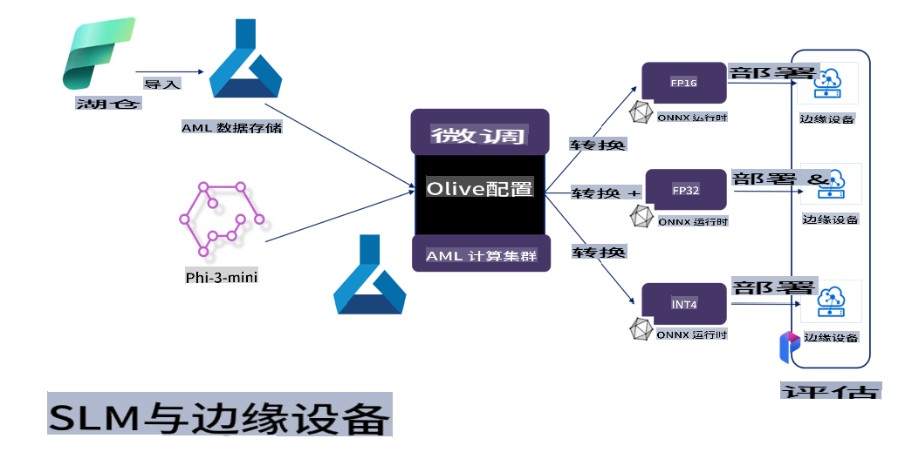

# **使用 Microsoft Olive 微调 Phi-3**

[Olive](https://github.com/microsoft/OLive?WT.mc_id=aiml-138114-kinfeylo) 是一个易于使用的硬件感知模型优化工具，它集合了业界领先的模型压缩、优化和编译技术。

它旨在简化优化机器学习模型的过程，确保模型能够最有效地利用特定的硬件架构。

无论您是在云端应用还是边缘设备上工作，Olive 都能让您轻松高效地优化模型。

## 主要特性：
- Olive 聚合并自动化了针对目标硬件的优化技术。
- 没有单一的优化技术适用于所有场景，因此 Olive 允许行业专家通过插件扩展他们的优化创新。

## 减少工程工作量：
- 开发人员通常需要学习和使用多个硬件供应商特定的工具链，以准备和优化训练好的模型进行部署。
- Olive 通过自动化优化技术简化了这一体验。

## 即插即用的端到端优化解决方案：

通过组合和调整集成的技术，Olive 提供了一个统一的端到端优化解决方案。
在优化模型时，它会考虑准确性和延迟等约束。

## 使用 Microsoft Olive 进行微调

Microsoft Olive 是一个非常易于使用的开源模型优化工具，可以覆盖生成式人工智能领域的微调和参考。它只需要简单的配置，结合使用开源的小型语言模型和相关的运行环境（AzureML / 本地 GPU，CPU，DirectML），就可以通过自动优化完成模型的微调或参考，并找到最佳模型部署到云端或边缘设备上。允许企业在本地和云端构建自己的行业垂直模型。


## 使用 Microsoft Olive 微调 Phi-3



## Phi-3 Olive 示例代码和示例
在这个示例中，您将使用 Olive 来：

- 微调一个 LoRA 适配器，将短语分类为悲伤、快乐、恐惧、惊讶。
- 将适配器权重合并到基础模型中。
- 优化并量化模型为 int4。

[示例代码](../../code/04.Finetuning/olive-ort-example/README.md)

### 安装 Microsoft Olive

Microsoft Olive 的安装非常简单，并且可以安装在 CPU、GPU、DirectML 和 Azure ML 上

```bash
pip install olive-ai
```

如果您希望在 CPU 上运行 ONNX 模型，可以使用

```bash
pip install olive-ai[cpu]
```

如果您希望在 GPU 上运行 ONNX 模型，可以使用

```python
pip install olive-ai[gpu]
```

如果您想使用 Azure ML，可以使用

```python
pip install git+https://github.com/microsoft/Olive#egg=olive-ai[azureml]
```

**注意**
操作系统要求：Ubuntu 20.04 / 22.04

### **Microsoft Olive 的 Config.json**

安装完成后，您可以通过 Config 文件配置不同的模型特定设置，包括数据、计算、训练、部署和模型生成。

**1. 数据**

在 Microsoft Olive 上，可以支持本地数据和云数据的训练，并可以在设置中进行配置。

*本地数据设置*

您可以简单地设置需要微调的数据集，通常为 json 格式，并与数据模板进行适配。这需要根据模型的要求进行调整（例如，适配 Microsoft Phi-3-mini 所需的格式。如果您有其他模型，请参考其他模型所需的微调格式进行处理）。

```json
    "data_configs": [
        {
            "name": "dataset_default_train",
            "type": "HuggingfaceContainer",
            "load_dataset_config": {
                "params": {
                    "data_name": "json", 
                    "data_files":"dataset/dataset-classification.json",
                    "split": "train"
                }
            },
            "pre_process_data_config": {
                "params": {
                    "dataset_type": "corpus",
                    "text_cols": [
                            "phrase",
                            "tone"
                    ],
                    "text_template": "### Text: {phrase}\n### The tone is:\n{tone}",
                    "corpus_strategy": "join",
                    "source_max_len": 2048,
                    "pad_to_max_len": false,
                    "use_attention_mask": false
                }
            }
        }
    ],
```

**云数据源设置**

通过链接 Azure AI Studio/Azure Machine Learning Service 的数据存储来链接云中的数据，您可以选择通过 Microsoft Fabric 和 Azure Data 将不同的数据源引入 Azure AI Studio/Azure Machine Learning Service，作为微调数据的支持。

```json
    "data_configs": [
        {
            "name": "dataset_default_train",
            "type": "HuggingfaceContainer",
            "load_dataset_config": {
                "params": {
                    "data_name": "json", 
                    "data_files": {
                        "type": "azureml_datastore",
                        "config": {
                            "azureml_client": {
                                "subscription_id": "Your Azure Subscrition ID",
                                "resource_group": "Your Azure Resource Group",
                                "workspace_name": "Your Azure ML Workspaces name"
                            },
                            "datastore_name": "workspaceblobstore",
                            "relative_path": "Your train_data.json Azure ML Location"
                        }
                    },
                    "split": "train"
                }
            },
            "pre_process_data_config": {
                "params": {
                    "dataset_type": "corpus",
                    "text_cols": [
                            "Question",
                            "Best Answer"
                    ],
                    "text_template": "<|user|>\n{Question}<|end|>\n<|assistant|>\n{Best Answer}\n<|end|>",
                    "corpus_strategy": "join",
                    "source_max_len": 2048,
                    "pad_to_max_len": false,
                    "use_attention_mask": false
                }
            }
        }
    ],
```

**2. 计算配置**

如果需要本地化，您可以直接使用本地数据资源。需要使用 Azure AI Studio / Azure Machine Learning Service 的资源，需要配置相关的 Azure 参数、计算资源名称等。

```json
    "systems": {
        "aml": {
            "type": "AzureML",
            "config": {
                "accelerators": ["gpu"],
                "hf_token": true,
                "aml_compute": "Your Azure AI Studio / Azure Machine Learning Service Compute Name",
                "aml_docker_config": {
                    "base_image": "Your Azure AI Studio / Azure Machine Learning Service docker",
                    "conda_file_path": "conda.yaml"
                }
            }
        },
        "azure_arc": {
            "type": "AzureML",
            "config": {
                "accelerators": ["gpu"],
                "aml_compute": "Your Azure AI Studio / Azure Machine Learning Service Compute Name",
                "aml_docker_config": {
                    "base_image": "Your Azure AI Studio / Azure Machine Learning Service docker",
                    "conda_file_path": "conda.yaml"
                }
            }
        }
    },
```

***注意***

因为它是通过 Azure AI Studio/Azure Machine Learning Service 上的容器运行的，需要配置所需的环境。这是在 conda.yaml 环境中配置的。

```yaml
name: project_environment
channels:
  - defaults
dependencies:
  - python=3.8.13
  - pip=22.3.1
  - pip:
      - einops
      - accelerate
      - azure-keyvault-secrets
      - azure-identity
      - bitsandbytes
      - datasets
      - huggingface_hub
      - peft
      - scipy
      - sentencepiece
      - torch>=2.2.0
      - transformers
      - git+https://github.com/microsoft/Olive@jiapli/mlflow_loading_fix#egg=olive-ai[gpu]
      - --extra-index-url https://aiinfra.pkgs.visualstudio.com/PublicPackages/_packaging/ORT-Nightly/pypi/simple/ 
      - ort-nightly-gpu==1.18.0.dev20240307004
      - --extra-index-url https://aiinfra.pkgs.visualstudio.com/PublicPackages/_packaging/onnxruntime-genai/pypi/simple/
      - onnxruntime-genai-cuda
```

**3. 选择您的 SLM**

您可以直接使用 Hugging face 上的模型，或者直接结合 Azure AI Studio / Azure Machine Learning 的模型目录来选择要使用的模型。在下面的代码示例中，我们将以 Microsoft Phi-3-mini 为例。

如果您有本地模型，可以使用这种方法

```json
    "input_model":{
        "type": "PyTorchModel",
        "config": {
            "hf_config": {
                "model_name": "model-cache/microsoft/phi-3-mini",
                "task": "text-generation",
                "model_loading_args": {
                    "trust_remote_code": true
                }
            }
        }
    },
```

如果您想使用 Azure AI Studio / Azure Machine Learning Service 的模型，可以使用这种方法

```json
    "input_model":{
        "type": "PyTorchModel",
        "config": {
            "model_path": {
                "type": "azureml_registry_model",
                "config": {
                    "name": "microsoft/Phi-3-mini-4k-instruct",
                    "registry_name": "azureml-msr",
                    "version": "11"
                }
            },
             "model_file_format": "PyTorch.MLflow",
             "hf_config": {
                "model_name": "microsoft/Phi-3-mini-4k-instruct",
                "task": "text-generation",
                "from_pretrained_args": {
                    "trust_remote_code": true
                }
            }
        }
    },
```

**注意：**
我们需要与 Azure AI Studio / Azure Machine Learning Service 集成，因此在设置模型时，请参考版本号和相关命名。

所有 Azure 上的模型都需要设置为 PyTorch.MLflow

您需要有一个 Hugging face 账号，并将密钥绑定到 Azure AI Studio / Azure Machine Learning 的 Key 值。

**4. 算法**

Microsoft Olive 很好地封装了 Lora 和 QLora 微调算法。您只需要配置一些相关参数。这里以 QLora 为例。

```json
        "lora": {
            "type": "LoRA",
            "config": {
                "target_modules": [
                    "o_proj",
                    "qkv_proj"
                ],
                "double_quant": true,
                "lora_r": 64,
                "lora_alpha": 64,
                "lora_dropout": 0.1,
                "train_data_config": "dataset_default_train",
                "eval_dataset_size": 0.3,
                "training_args": {
                    "seed": 0,
                    "data_seed": 42,
                    "per_device_train_batch_size": 1,
                    "per_device_eval_batch_size": 1,
                    "gradient_accumulation_steps": 4,
                    "gradient_checkpointing": false,
                    "learning_rate": 0.0001,
                    "num_train_epochs": 3,
                    "max_steps": 10,
                    "logging_steps": 10,
                    "evaluation_strategy": "steps",
                    "eval_steps": 187,
                    "group_by_length": true,
                    "adam_beta2": 0.999,
                    "max_grad_norm": 0.3
                }
            }
        },
```

如果您想进行量化转换，Microsoft Olive 主分支已经支持 onnxruntime-genai 方法。您可以根据需要进行设置：

1. 将适配器权重合并到基础模型
2. 使用 ModelBuilder 将模型转换为所需精度的 onnx 模型

例如转换为量化的 INT4

```json
        "merge_adapter_weights": {
            "type": "MergeAdapterWeights"
        },
        "builder": {
            "type": "ModelBuilder",
            "config": {
                "precision": "int4"
            }
        }
```

**注意**
- 如果您使用 QLoRA，暂时不支持 ONNXRuntime-genai 的量化转换。

- 这里需要指出的是，您可以根据自己的需要设置上述步骤。不需要完全配置上述这些步骤。根据您的需要，您可以直接使用算法的步骤而无需微调。最后，您需要配置相关的引擎。

```json
    "engine": {
        "log_severity_level": 0,
        "host": "aml",
        "target": "aml",
        "search_strategy": false,
        "execution_providers": ["CUDAExecutionProvider"],
        "cache_dir": "../model-cache/models/phi3-finetuned/cache",
        "output_dir" : "../model-cache/models/phi3-finetuned"
    }
```

**5. 完成微调**

在命令行中，在 olive-config.json 的目录中执行

```bash
olive run --config olive-config.json  
```

免责声明：此翻译由AI模型从原文翻译而来，可能不完全准确。请审阅输出内容并进行必要的修改。