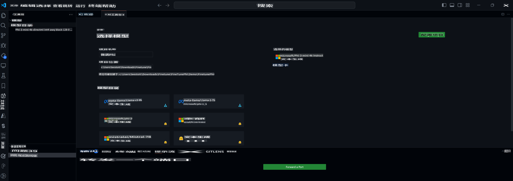

## 欢迎使用 VS Code 的 AI 工具包

[VS Code 的 AI 工具包](https://github.com/microsoft/vscode-ai-toolkit/tree/main) 集成了来自 Azure AI Studio Catalog 和其他目录（如 Hugging Face）的各种模型。该工具包通过以下方式简化了构建 AI 应用的常见开发任务：
- 开始模型发现和游乐场。
- 使用本地计算资源进行模型微调和推理。
- 使用 Azure 资源进行远程微调和推理。

[安装 VSCode 的 AI 工具包](https://marketplace.visualstudio.com/items?itemName=ms-windows-ai-studio.windows-ai-studio)



**[私密预览]** 一键配置 Azure Container Apps 以在云中运行模型微调和推理。

现在让我们开始你的 AI 应用开发：

- [本地开发](../../../../md/04.Fine-tuning)
    - [准备工作](../../../../md/04.Fine-tuning)
    - [激活 Conda](../../../../md/04.Fine-tuning)
    - [仅基础模型微调](../../../../md/04.Fine-tuning)
    - [模型微调和推理](../../../../md/04.Fine-tuning)
- [**[私密预览]** 远程开发](../../../../md/04.Fine-tuning)
    - [先决条件](../../../../md/04.Fine-tuning)
    - [设置远程开发项目](../../../../md/04.Fine-tuning)
    - [配置 Azure 资源](../../../../md/04.Fine-tuning)
    - [[可选] 将 Huggingface Token 添加到 Azure Container App Secret](../../../../md/04.Fine-tuning)
    - [运行微调](../../../../md/04.Fine-tuning)
    - [配置推理端点](../../../../md/04.Fine-tuning)
    - [部署推理端点](../../../../md/04.Fine-tuning)
    - [高级用法](../../../../md/04.Fine-tuning)

## 本地开发
### 准备工作

1. 确保主机上安装了 NVIDIA 驱动程序。
2. 如果你使用 HF 进行数据集利用，运行 `huggingface-cli login`。
3. `Olive` 键设置解释任何修改内存使用的内容。

### 激活 Conda
由于我们使用的是 WSL 环境并且是共享的，因此需要手动激活 conda 环境。完成此步骤后，你可以运行微调或推理。

```bash
conda activate [conda-env-name]
```

### 仅基础模型微调
如果你只想尝试基础模型而不进行微调，可以在激活 conda 后运行此命令。

```bash
cd inference

# Web 浏览器界面允许调整一些参数，如最大新令牌长度、温度等。
# 用户需要在 gradio 建立连接后手动在浏览器中打开链接（例如 http://0.0.0.0:7860）。
python gradio_chat.py --baseonly
```

### 模型微调和推理

一旦工作区在开发容器中打开，打开终端（默认路径为项目根目录），然后运行以下命令在选定的数据集上微调 LLM。

```bash
python finetuning/invoke_olive.py
```

检查点和最终模型将保存在 `models` 文件夹中。

接下来，通过 `控制台`、`Web 浏览器` 或 `prompt flow` 使用微调后的模型进行推理。

```bash
cd inference

# 控制台界面。
python console_chat.py

# Web 浏览器界面允许调整一些参数，如最大新令牌长度、温度等。
# 用户需要在 gradio 建立连接后手动在浏览器中打开链接（例如 http://127.0.0.1:7860）。
python gradio_chat.py
```

要在 VS Code 中使用 `prompt flow`，请参阅此[快速入门](https://microsoft.github.io/promptflow/how-to-guides/quick-start.html)。

### 模型微调

接下来，根据设备上是否有 GPU，下载以下模型。

要使用 QLoRA 启动本地微调会话，请从我们的目录中选择你要微调的模型。
| 平台 | 是否有 GPU | 模型名称 | 大小 (GB) |
|---------|---------|--------|--------|
| Windows | 有 | Phi-3-mini-4k-**directml**-int4-awq-block-128-onnx | 2.13GB |
| Linux | 有 | Phi-3-mini-4k-**cuda**-int4-onnx | 2.30GB |
| Windows<br>Linux | 无 | Phi-3-mini-4k-**cpu**-int4-rtn-block-32-acc-level-4-onnx | 2.72GB |

**_注意_** 你不需要 Azure 账户即可下载这些模型

Phi3-mini (int4) 模型大约为 2GB-3GB。根据你的网络速度，下载可能需要几分钟。

首先选择一个项目名称和位置。
接下来，从模型目录中选择一个模型。系统会提示你下载项目模板。然后，你可以点击“配置项目”来调整各种设置。

### Microsoft Olive

我们使用 [Olive](https://microsoft.github.io/Olive/overview/olive.html) 在我们的目录中运行 PyTorch 模型的 QLoRA 微调。所有设置均已预设为默认值，以优化本地内存使用，但可以根据你的场景进行调整。

### 微调示例和资源

- [微调入门指南](https://learn.microsoft.com/windows/ai/toolkit/toolkit-fine-tune)
- [使用 HuggingFace 数据集进行微调](https://github.com/microsoft/vscode-ai-toolkit/blob/main/archive/walkthrough-hf-dataset.md)
- [使用简单数据集进行微调](https://github.com/microsoft/vscode-ai-toolkit/blob/main/archive/walkthrough-simple-dataset.md)

## **[私密预览]** 远程开发
### 先决条件
1. 要在远程 Azure Container App 环境中运行模型微调，请确保你的订阅有足够的 GPU 容量。提交 [支持票](https://azure.microsoft.com/support/create-ticket/) 以请求你的应用所需的容量。[了解更多关于 GPU 容量的信息](https://learn.microsoft.com/azure/container-apps/workload-profiles-overview)
2. 如果你使用 HuggingFace 上的私有数据集，请确保你有一个 [HuggingFace 账户](https://huggingface.co/) 并[生成访问令牌](https://huggingface.co/docs/hub/security-tokens)
3. 在 VS Code 的 AI 工具包中启用远程微调和推理功能标志
   1. 选择 *文件 -> 首选项 -> 设置* 打开 VS Code 设置。
   2. 导航到 *扩展* 并选择 *AI 工具包*。
   3. 选择 *"启用远程微调和推理"* 选项。
   4. 重新加载 VS Code 以生效。

- [远程微调](https://github.com/microsoft/vscode-ai-toolkit/blob/main/archive/remote-finetuning.md)

### 设置远程开发项目
1. 执行命令面板 `AI Toolkit: Focus on Resource View`。
2. 导航到 *模型微调* 访问模型目录。为你的项目分配一个名称并选择其在机器上的位置。然后点击 *"配置项目"* 按钮。
3. 项目配置
    1. 避免启用 *"本地微调"* 选项。
    2. Olive 配置设置将以预设默认值出现。请根据需要调整和填写这些配置。
    3. 继续 *生成项目*。此阶段利用 WSL 并设置一个新的 Conda 环境，为未来包括开发容器的更新做准备。
4. 点击 *"在工作区中重新启动窗口"* 以打开你的远程开发项目。

> **注意:** 该项目目前在 VS Code 的 AI 工具包中只能在本地或远程工作。如果你在项目创建期间选择 *"本地微调"*，它将仅在 WSL 中运行，而没有远程开发功能。另一方面，如果你没有启用 *"本地微调"*，该项目将仅限于远程 Azure Container App 环境。

### 配置 Azure 资源
要开始，请通过运行命令面板中的 `AI Toolkit: Provision Azure Container Apps job for fine-tuning` 配置 Azure 资源以进行远程微调。

通过输出频道中显示的链接监控配置进度。

### [可选] 将 Huggingface Token 添加到 Azure Container App Secret
如果你使用的是私有 HuggingFace 数据集，请将你的 HuggingFace 令牌设置为环境变量，以避免在 Hugging Face Hub 上手动登录。
你可以使用 `AI Toolkit: Add Azure Container Apps Job secret for fine-tuning` 命令来设置机密名称为 [`HF_TOKEN`](https://huggingface.co/docs/huggingface_hub/package_reference/environment_variables#hftoken) 并使用你的 Hugging Face 令牌作为机密值。

### 运行微调
要启动远程微调作业，请执行 `AI Toolkit: Run fine-tuning` 命令。

要查看系统和控制台日志，你可以使用输出面板中的链接访问 Azure 门户（更多步骤请参阅 [在 Azure 上查看和查询日志](https://aka.ms/ai-toolkit/remote-provision#view-and-query-logs-on-azure)）。或者，你可以通过在 VSCode 输出面板中运行命令 `AI Toolkit: Show the running fine-tuning job streaming logs` 直接查看控制台日志。
> **注意:** 作业可能由于资源不足而排队。如果未显示日志，请执行 `AI Toolkit: Show the running fine-tuning job streaming logs` 命令，等待一会儿，然后再次执行该命令以重新连接到流日志。

在此过程中，将使用 QLoRA 进行微调，并为模型创建 LoRA 适配器以在推理期间使用。
微调结果将存储在 Azure 文件中。

### 配置推理端点
在远程环境中训练好适配器后，使用一个简单的 Gradio 应用与模型交互。
与微调过程类似，你需要通过执行命令面板中的 `AI Toolkit: Provision Azure Container Apps for inference` 配置 Azure 资源以进行远程推理。

默认情况下，推理的订阅和资源组应与微调时使用的相同。推理将使用相同的 Azure Container App 环境，并访问在微调步骤中生成的存储在 Azure 文件中的模型和模型适配器。

### 部署推理端点
如果你希望修改推理代码或重新加载推理模型，请执行 `AI Toolkit: Deploy for inference` 命令。这将同步你的最新代码与 Azure Container App 并重新启动副本。

一旦部署成功完成，你可以通过 VSCode 通知中显示的 "*Go to Inference Endpoint*" 按钮访问推理 API。或者，Web API 端点可以在 `./infra/inference.config.json` 中的 `ACA_APP_ENDPOINT` 和输出面板中找到。你现在可以使用此端点评估模型。

### 高级用法
有关使用 AI 工具包进行远程开发的更多信息，请参阅 [远程微调模型](https://aka.ms/ai-toolkit/remote-provision) 和 [使用微调模型进行推理](https://aka.ms/ai-toolkit/remote-inference) 文档。

免责声明：此翻译由人工智能模型从原文翻译而来，可能并不完美。请审核输出内容并进行必要的修改。