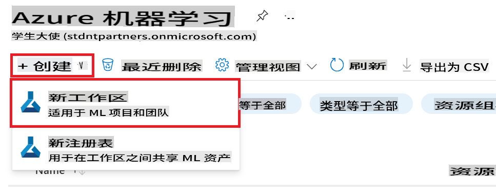
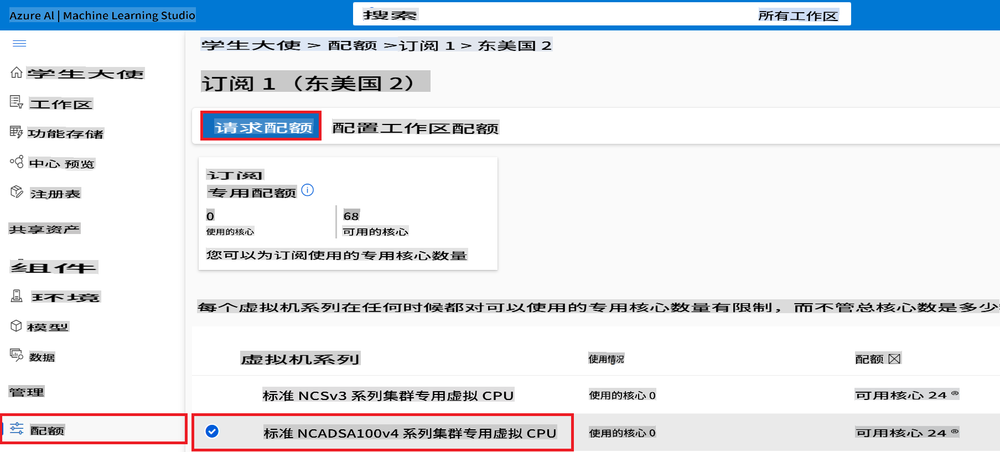

# 微调并集成自定义 Phi-3 模型与 Prompt flow

这个端到端（E2E）示例基于 Microsoft 技术社区的指南 "[Fine-Tune and Integrate Custom Phi-3 Models with Prompt Flow: Step-by-Step Guide](https://techcommunity.microsoft.com/t5/educator-developer-blog/fine-tune-and-integrate-custom-phi-3-models-with-prompt-flow/ba-p/4178612?WT.mc_id=aiml-137032-kinfeylo)"。它介绍了使用 Prompt flow 微调、部署和集成自定义 Phi-3 模型的过程。

## 概述

在这个 E2E 示例中，你将学习如何微调 Phi-3 模型并将其与 Prompt flow 集成。通过利用 Azure 机器学习和 Prompt flow，你将建立一个部署和使用自定义 AI 模型的工作流程。这个 E2E 示例分为三个场景：

**场景 1：设置 Azure 资源并为微调做准备**

**场景 2：微调 Phi-3 模型并在 Azure 机器学习工作室中部署**

**场景 3：与 Prompt flow 集成并与自定义模型聊天**

以下是这个 E2E 示例的概述。


### 目录

1. **[场景 1：设置 Azure 资源并为微调做准备](../../../../md/06.E2ESamples)**
    - [创建 Azure 机器学习工作区](../../../../md/06.E2ESamples)
    - [在 Azure 订阅中请求 GPU 配额](../../../../md/06.E2ESamples)
    - [添加角色分配](../../../../md/06.E2ESamples)
    - [设置项目](../../../../md/06.E2ESamples)
    - [准备用于微调的数据集](../../../../md/06.E2ESamples)

1. **[场景 2：微调 Phi-3 模型并在 Azure 机器学习工作室中部署](../../../../md/06.E2ESamples)**
    - [设置 Azure CLI](../../../../md/06.E2ESamples)
    - [微调 Phi-3 模型](../../../../md/06.E2ESamples)
    - [部署微调后的模型](../../../../md/06.E2ESamples)

1. **[场景 3：与 Prompt flow 集成并与自定义模型聊天](../../../../md/06.E2ESamples)**
    - [将自定义 Phi-3 模型与 Prompt flow 集成](../../../../md/06.E2ESamples)
    - [与自定义模型聊天](../../../../md/06.E2ESamples)

## 场景 1：设置 Azure 资源并为微调做准备

### 创建 Azure 机器学习工作区

1. 在门户页面顶部的**搜索栏**中输入 *azure machine learning* 并从出现的选项中选择 **Azure Machine Learning**。

    

1. 从导航菜单中选择 **+ 创建**。

1. 从导航菜单中选择 **新建工作区**。

    

1. 执行以下任务：

    - 选择你的 Azure **订阅**。
    - 选择要使用的 **资源组**（如有需要，请创建一个新的）。
    - 输入 **工作区名称**。它必须是唯一的值。
    - 选择你想使用的 **区域**。
    - 选择要使用的 **存储账户**（如有需要，请创建一个新的）。
    - 选择要使用的 **密钥保管库**（如有需要，请创建一个新的）。
    - 选择要使用的 **应用程序洞察**（如有需要，请创建一个新的）。
    - 选择要使用的 **容器注册表**（如有需要，请创建一个新的）。

    

1. 选择 **查看 + 创建**。

1. 选择 **创建**。

### 在 Azure 订阅中请求 GPU 配额

在这个 E2E 示例中，你将使用 *Standard_NC24ads_A100_v4 GPU* 进行微调，这需要配额请求，并使用 *Standard_E4s_v3* CPU 进行部署，这不需要配额请求。

> [!NOTE]
>
> 只有按需付费订阅（标准订阅类型）有资格分配 GPU；福利订阅目前不支持。
>
> 对于使用福利订阅（如 Visual Studio 企业订阅）或希望快速测试微调和部署过程的用户，本教程还提供了使用 CPU 和最小数据集进行微调的指导。然而，重要的是要注意，使用 GPU 和更大数据集进行微调的结果显著更好。

1. 访问 [Azure ML Studio](https://ml.azure.com/home?wt.mc_id=studentamb_279723)。

1. 执行以下任务以请求 *Standard NCADSA100v4 Family* 配额：

    - 从左侧选项卡中选择 **配额**。
    - 选择要使用的 **虚拟机系列**。例如，选择 **Standard NCADSA100v4 Family Cluster Dedicated vCPUs**，其中包括 *Standard_NC24ads_A100_v4* GPU。
    - 从导航菜单中选择 **请求配额**。

        

    - 在请求配额页面中，输入你想使用的 **新核心限制**。例如，24。
    - 在请求配额页面中，选择 **提交** 以请求 GPU 配额。

> [!NOTE]
> 你可以通过参考 [Azure 虚拟机的大小](https://learn.microsoft.com/azure/virtual-machines/sizes/overview?tabs=breakdownseries%2Cgeneralsizelist%2Ccomputesizelist%2Cmemorysizelist%2Cstoragesizelist%2Cgpusizelist%2Cfpgasizelist%2Chpcsizelist) 文档来选择适合你需求的 GPU 或 CPU。

### 添加角色分配

要微调和部署你的模型，你必须首先创建一个用户分配的托管身份（UAI）并分配适当的权限。这个 UAI 将在部署期间用于身份验证。

#### 创建用户分配的托管身份（UAI）

1. 在门户页面顶部的**搜索栏**中输入 *managed identities* 并从出现的选项中选择 **托管身份**。

    

1. 选择 **+ 创建**。

    

1. 执行以下任务：

    - 选择你的 Azure **订阅**。
    - 选择要使用的 **资源组**（如有需要，请创建一个新的）。
    - 选择你想使用的 **区域**。
    - 输入 **名称**。它必须是唯一的值。

1. 选择 **查看 + 创建**。

1. 选择 **+ 创建**。

#### 为托管身份添加贡献者角色分配

1. 导航到你创建的托管身份资源。

1. 从左侧选项卡中选择 **Azure 角色分配**。

1. 从导航菜单中选择 **+ 添加角色分配**。

1. 在添加角色分配页面中，执行以下任务：
    - 将 **范围** 选择为 **资源组**。
    - 选择你的 Azure **订阅**。
    - 选择要使用的 **资源组**。
    - 将 **角色** 选择为 **贡献者**。

    

1. 选择 **保存**。

#### 为托管身份添加存储 Blob 数据读取者角色分配

1. 在门户页面顶部的**搜索栏**中输入 *storage accounts* 并从出现的选项中选择 **存储账户**。

    

1. 选择与你创建的 Azure 机器学习工作区关联的存储账户。例如，*finetunephistorage*。

1. 执行以下任务以导航到添加角色分配页面：

    - 导航到你创建的 Azure 存储账户。
    - 从左侧选项卡中选择 **访问控制 (IAM)**。
    - 从导航菜单中选择 **+ 添加**。
    - 从导航菜单中选择 **添加角色分配**。

    

1. 在添加角色分配页面中，执行以下任务：

    - 在角色页面中，在**搜索栏**中输入 *Storage Blob Data Reader* 并从出现的选项中选择 **Storage Blob Data Reader**。
    - 在角色页面中，选择 **下一步**。
    - 在成员页面中，将 **分配访问权限** 选择为 **托管身份**。
    - 在成员页面中，选择 **+ 选择成员**。
    - 在选择托管身份页面中，选择你的 Azure **订阅**。
    - 在选择托管身份页面中，将 **托管身份** 选择为 **托管身份**。
    - 在选择托管身份页面中，选择你创建的托管身份。例如，*finetunephi-managedidentity*。
    - 在选择托管身份页面中，选择 **选择**。

    

1. 选择 **查看 + 分配**。

#### 为托管身份添加 AcrPull 角色分配

1. 在门户页面顶部的**搜索栏**中输入 *container registries* 并从出现的选项中选择 **容器注册表**。

    

1. 选择与你的 Azure 机器学习工作区关联的容器注册表。例如，*finetunephicontainerregistries*

1. 执行以下任务以导航到添加角色分配页面：

    - 从左侧选项卡中选择 **访问控制 (IAM)**。
    - 从导航菜单中选择 **+ 添加**。
    - 从导航菜单中选择 **添加角色分配**。

1. 在添加角色分配页面中，执行以下任务：

    - 在角色页面中，在**搜索栏**中输入 *AcrPull* 并从出现的选项中选择 **AcrPull**。
    - 在角色页面中，选择 **下一步**。
    - 在成员页面中，将 **分配访问权限** 选择为 **托管身份**。
    - 在成员页面中，选择 **+ 选择成员**。
    - 在选择托管身份页面中，选择你的 Azure **订阅**。
    - 在选择托管身份页面中，将 **托管身份** 选择为 **托管身份**。
    - 在选择托管身份页面中，选择你创建的托管身份。例如，*finetunephi-managedidentity*。
    - 在选择托管身份页面中，选择 **选择**。
    - 选择 **查看 + 分配**。

### 设置项目

现在，你将创建一个文件夹进行工作，并设置一个虚拟环境来开发一个与用户交互并使用来自 Azure Cosmos DB 的存储聊天记录来提供响应的程序。

#### 创建工作文件夹

1. 打开终端窗口并输入以下命令，在默认路径下创建一个名为 *finetune-phi* 的文件夹。

    ```console
    mkdir finetune-phi
    ```

1. 在终端中输入以下命令，导航到你创建的 *finetune-phi* 文件夹。

    ```console
    cd finetune-phi
    ```

#### 创建虚拟环境

1. 在终端中输入以下命令，创建一个名为 *.venv* 的虚拟环境。

    ```console
    python -m venv .venv
    ```

1. 在终端中输入以下命令，激活虚拟环境。

    ```console
    .venv\Scripts\activate.bat
    ```

> [!NOTE]
>
> 如果成功，你应该在命令提示符前看到 *(.venv)*。

#### 安装所需的软件包

1. 在终端中输入以下命令，安装所需的软件包。

    ```console
    pip install datasets==2.19.1
    pip install transformers==4.41.1
    pip install azure-ai-ml==1.16.0
    pip install torch==2.3.1
    pip install trl==0.9.4
    pip install promptflow==1.12.0
    ```

#### 创建项目文件

在这个练习中，你将为我们的项目创建必要的文件。这些文件包括下载数据集的脚本、设置 Azure 机器学习环境的脚本、微调 Phi-3 模型的脚本以及部署微调模型的脚本。你还将创建一个 *conda.yml* 文件来设置微调环境。

在这个练习中，你将：

- 创建一个 *download_dataset.py* 文件来下载数据集。
- 创建一个 *setup_ml.py* 文件来设置 Azure 机器学习环境。
- 在 *finetuning_dir* 文件夹中创建一个 *fine_tune.py* 文件，使用数据集微调 Phi-3 模型。
- 创建一个 *conda.yml* 文件来设置微调环境。
- 创建一个 *deploy_model.py* 文件来部署微调后的模型。
- 创建一个 *integrate_with_promptflow.py* 文件，将微调后的模型与 Prompt flow 集成并执行模型。
- 创建一个 *flow.dag.yml* 文件，设置 Prompt flow 的工作流结构。
- 创建一个 *config.py* 文件来输入 Azure 信息。

> [!NOTE]
>
> 完整的文件夹结构：
>
> ```text
> └── YourUserName
> .    └── finetune-phi
> .        ├── finetuning_dir
> .        │      └── fine_tune.py
> .        ├── conda.yml
> .        ├── config.py
> .        ├── deploy_model.py
> .        ├── download_dataset.py
> .        ├── flow.dag.yml
> .        ├── integrate_with_promptflow.py
> .        └── setup_ml.py
> ```

1. 打开 **Visual Studio Code**。

1. 从菜单栏中选择 **文件**。

1. 选择 **打开文件夹**。

1. 选择你创建的 *finetune-phi* 文件夹，它位于 *C:\Users\yourUserName\finetune-phi*。

    

1. 在 Visual Studio Code 的左侧窗格中，右键单击并选择 **新建文件**，创建一个名为 *download_dataset.py* 的新文件。

1. 在 Visual Studio Code 的左侧窗格中，右键单击并选择 **新建文件**，创建一个名为 *setup_ml.py* 的新文件。

1. 在 Visual Studio Code 的左侧窗格中，右键单击并选择 **新建文件**，创建一个名为 *deploy_model.py* 的新文件。

    

1. 在 Visual Studio Code 的左侧窗格中，右键单击并选择 **新建文件夹**，创建一个名为 *finetuning_dir* 的新文件夹。

1. 在 *finetuning_dir* 文件夹中，创建一个名为 *fine_tune.py* 的新文件。

#### 创建和配置 *conda.yml* 文件

1. 在 Visual Studio Code 的左侧窗格中，右键单击并选择 **新建文件**，创建一个名为 *conda.yml* 的新文件。

1. 将以下代码添加到 *conda.yml* 文件中，以设置 Phi-3 模型的微调环境。

    ```yml
    name: phi-3-training-env
    channels:
      - defaults
      - conda-forge
    dependencies:
      - python=3.10
      - pip
      - numpy<2.0
      - pip:
          - torch==2.4.0
          - torchvision==0.19.0
          - trl==0.8.6
          - transformers==4.41
          - datasets==2.21.0
          - azureml-core==1.57.0
          - azure-storage-blob==12.19.0
          - azure-ai-ml==1.16
          - azure-identity==1.17.1
          - accelerate==0.33.0
          - mlflow==2.15.1
          - azureml-mlflow==1.57.0
    ```

#### 创建和配置 *config.py* 文件

1. 在 Visual Studio Code 的左侧窗格中，右键单击并选择 **新建文件**，创建一个名为 *config.py* 的新文件。

1. 将以下代码添加到 *config.py* 文件中，以包含你的 Azure 信息。

    ```python
    # Azure settings
    AZURE_SUBSCRIPTION_ID = "your_subscription_id"
    AZURE_RESOURCE_GROUP_NAME = "your_resource_group_name" # "TestGroup"

    # Azure Machine Learning settings
    AZURE_ML_WORKSPACE_NAME = "your_workspace_name" # "finetunephi-workspace"

    # Azure Managed Identity settings
    AZURE_MANAGED_IDENTITY_CLIENT_ID = "your_azure_managed_identity_client_id"
    AZURE_MANAGED_IDENTITY_NAME =


免责声明：本翻译由人工智能模型从原文翻译而来，可能并不完美。请审阅输出内容并进行必要的修改。