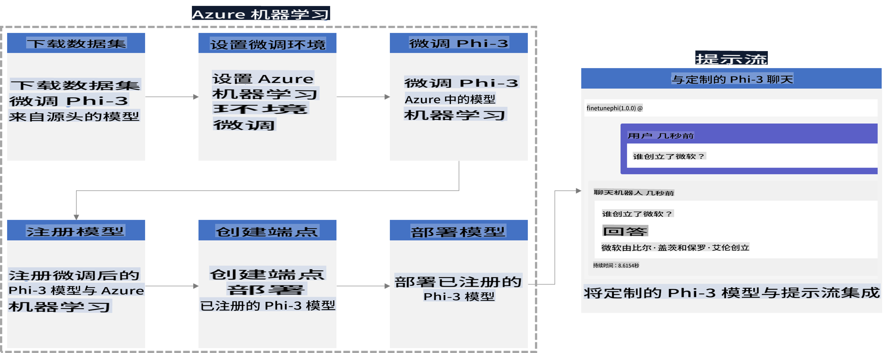
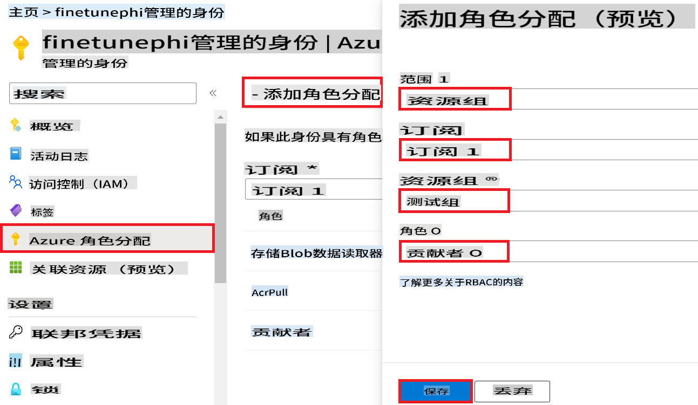
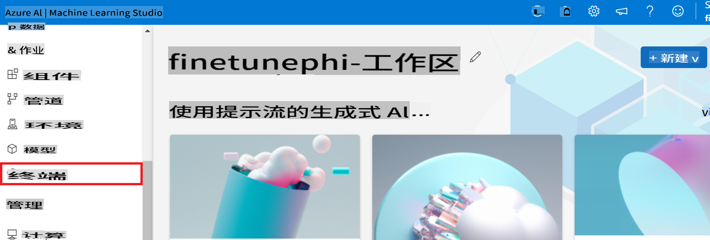
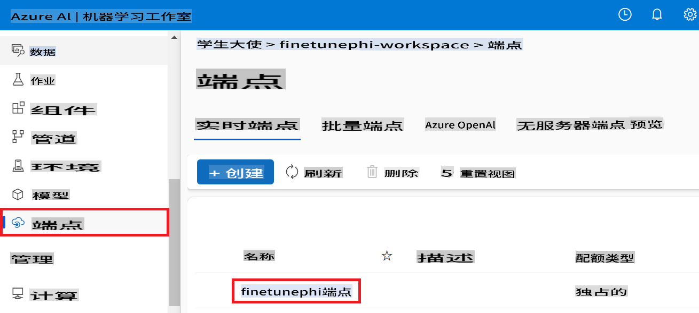
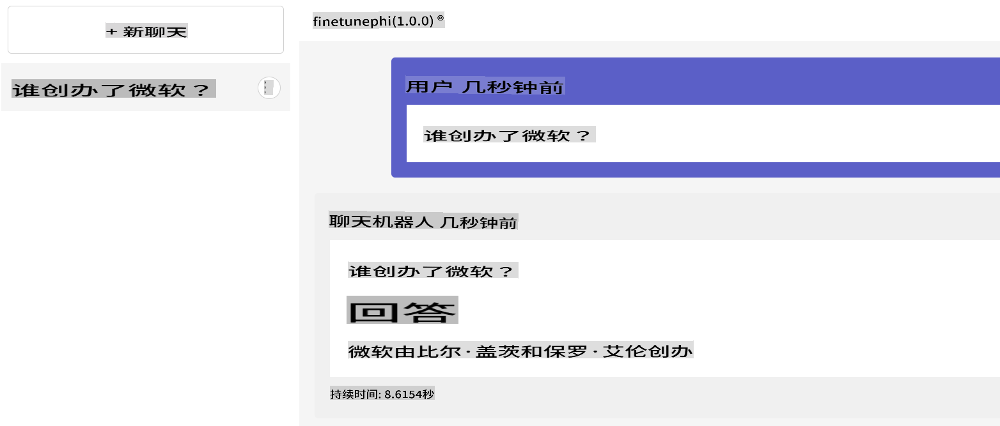

# 使用 Prompt flow 微调和集成自定义 Phi-3 模型

这个端到端（E2E）示例基于 Microsoft Tech Community 的指南 "[Fine-Tune and Integrate Custom Phi-3 Models with Prompt Flow: Step-by-Step Guide](https://techcommunity.microsoft.com/t5/educator-developer-blog/fine-tune-and-integrate-custom-phi-3-models-with-prompt-flow/ba-p/4178612?WT.mc_id=aiml-137032-kinfeylo)"。它介绍了使用 Prompt flow 微调、部署和集成自定义 Phi-3 模型的过程。

## 概述

在这个 E2E 示例中，你将学习如何微调 Phi-3 模型并将其与 Prompt flow 集成。通过利用 Azure Machine Learning 和 Prompt flow，你将建立一个用于部署和使用自定义 AI 模型的工作流程。这个 E2E 示例分为三个场景：

**场景 1：设置 Azure 资源并为微调做准备**

**场景 2：微调 Phi-3 模型并在 Azure Machine Learning Studio 中部署**

**场景 3：与 Prompt flow 集成并与自定义模型聊天**

以下是这个 E2E 示例的概述。



### 目录

1. **[场景 1：设置 Azure 资源并为微调做准备](../../../../md/06.E2ESamples)**
    - [创建一个 Azure Machine Learning 工作区](../../../../md/06.E2ESamples)
    - [在 Azure 订阅中请求 GPU 配额](../../../../md/06.E2ESamples)
    - [添加角色分配](../../../../md/06.E2ESamples)
    - [设置项目](../../../../md/06.E2ESamples)
    - [准备微调的数据集](../../../../md/06.E2ESamples)

1. **[场景 2：微调 Phi-3 模型并在 Azure Machine Learning Studio 中部署](../../../../md/06.E2ESamples)**
    - [设置 Azure CLI](../../../../md/06.E2ESamples)
    - [微调 Phi-3 模型](../../../../md/06.E2ESamples)
    - [部署微调后的模型](../../../../md/06.E2ESamples)

1. **[场景 3：与 Prompt flow 集成并与自定义模型聊天](../../../../md/06.E2ESamples)**
    - [将自定义 Phi-3 模型与 Prompt flow 集成](../../../../md/06.E2ESamples)
    - [与自定义模型聊天](../../../../md/06.E2ESamples)

## 场景 1：设置 Azure 资源并为微调做准备

### 创建一个 Azure Machine Learning 工作区

1. 在门户页面顶部的**搜索栏**中输入 *azure machine learning*，然后从出现的选项中选择 **Azure Machine Learning**。

    

1. 从导航菜单中选择 **+ 创建**。

1. 从导航菜单中选择 **新建工作区**。

    

1. 执行以下任务：

    - 选择你的 Azure **订阅**。
    - 选择要使用的 **资源组**（如果需要，可以创建一个新的）。
    - 输入 **工作区名称**。它必须是唯一的值。
    - 选择你想使用的 **区域**。
    - 选择要使用的 **存储账户**（如果需要，可以创建一个新的）。
    - 选择要使用的 **密钥保管库**（如果需要，可以创建一个新的）。
    - 选择要使用的 **应用程序洞察**（如果需要，可以创建一个新的）。
    - 选择要使用的 **容器注册表**（如果需要，可以创建一个新的）。

    

1. 选择 **查看 + 创建**。

1. 选择 **创建**。

### 在 Azure 订阅中请求 GPU 配额

在这个 E2E 示例中，你将使用 *Standard_NC24ads_A100_v4 GPU* 进行微调，这需要请求配额，并使用 *Standard_E4s_v3* CPU 进行部署，这不需要请求配额。

> [!NOTE]
>
> 只有按需付费订阅（标准订阅类型）有资格分配 GPU；福利订阅目前不支持。
>
> 对于使用福利订阅（如 Visual Studio Enterprise Subscription）或希望快速测试微调和部署过程的人，本教程还提供了使用 CPU 和最小数据集进行微调的指南。然而，使用 GPU 和更大数据集进行微调的结果显著更好。

1. 访问 [Azure ML Studio](https://ml.azure.com/home?wt.mc_id=studentamb_279723)。

1. 执行以下任务以请求 *Standard NCADSA100v4 Family* 配额：

    - 从左侧选项卡中选择 **配额**。
    - 选择要使用的 **虚拟机系列**。例如，选择 **Standard NCADSA100v4 Family Cluster Dedicated vCPUs**，其中包括 *Standard_NC24ads_A100_v4* GPU。
    - 从导航菜单中选择 **请求配额**。

        

    - 在请求配额页面，输入你想使用的 **新核心限制**。例如，24。
    - 在请求配额页面，选择 **提交** 以请求 GPU 配额。

> [!NOTE]
> 你可以通过参考 [Azure 虚拟机大小](https://learn.microsoft.com/azure/virtual-machines/sizes/overview?tabs=breakdownseries%2Cgeneralsizelist%2Ccomputesizelist%2Cmemorysizelist%2Cstoragesizelist%2Cgpusizelist%2Cfpgasizelist%2Chpcsizelist) 文档选择适合你需求的 GPU 或 CPU。

### 添加角色分配

要微调和部署你的模型，首先必须创建一个用户分配的托管身份（UAI）并赋予其适当的权限。这个 UAI 将在部署期间用于身份验证。

#### 创建用户分配的托管身份（UAI）

1. 在门户页面顶部的**搜索栏**中输入 *managed identities*，然后从出现的选项中选择 **托管身份**。

    

1. 选择 **+ 创建**。

    

1. 执行以下任务：

    - 选择你的 Azure **订阅**。
    - 选择要使用的 **资源组**（如果需要，可以创建一个新的）。
    - 选择你想使用的 **区域**。
    - 输入 **名称**。它必须是唯一的值。

1. 选择 **查看 + 创建**。

1. 选择 **+ 创建**。

#### 为托管身份添加贡献者角色分配

1. 导航到你创建的托管身份资源。

1. 从左侧选项卡中选择 **Azure 角色分配**。

1. 从导航菜单中选择 **+ 添加角色分配**。

1. 在添加角色分配页面，执行以下任务：
    - 选择 **范围** 为 **资源组**。
    - 选择你的 Azure **订阅**。
    - 选择要使用的 **资源组**。
    - 选择 **角色** 为 **贡献者**。

    

1. 选择 **保存**。

#### 为托管身份添加存储 Blob 数据读取者角色分配

1. 在门户页面顶部的**搜索栏**中输入 *storage accounts*，然后从出现的选项中选择 **存储账户**。

    

1. 选择与创建的 Azure Machine Learning 工作区关联的存储账户。例如，*finetunephistorage*。

1. 执行以下任务以导航到添加角色分配页面：

    - 导航到你创建的 Azure 存储账户。
    - 从左侧选项卡中选择 **访问控制（IAM）**。
    - 从导航菜单中选择 **+ 添加**。
    - 从导航菜单中选择 **添加角色分配**。

    

1. 在添加角色分配页面，执行以下任务：

    - 在角色页面，输入 *Storage Blob Data Reader* 在**搜索栏**中，并从出现的选项中选择 **Storage Blob Data Reader**。
    - 在角色页面，选择 **下一步**。
    - 在成员页面，选择 **分配访问给** **托管身份**。
    - 在成员页面，选择 **+ 选择成员**。
    - 在选择托管身份页面，选择你的 Azure **订阅**。
    - 在选择托管身份页面，选择 **托管身份** 为 **托管身份**。
    - 在选择托管身份页面，选择你创建的托管身份。例如，*finetunephi-managedidentity*。
    - 在选择托管身份页面，选择 **选择**。

    

1. 选择 **查看 + 分配**。

#### 为托管身份添加 AcrPull 角色分配

1. 在门户页面顶部的**搜索栏**中输入 *container registries*，然后从出现的选项中选择 **容器注册表**。

    

1. 选择与创建的 Azure Machine Learning 工作区关联的容器注册表。例如，*finetunephicontainerregistries*。

1. 执行以下任务以导航到添加角色分配页面：

    - 从左侧选项卡中选择 **访问控制（IAM）**。
    - 从导航菜单中选择 **+ 添加**。
    - 从导航菜单中选择 **添加角色分配**。

1. 在添加角色分配页面，执行以下任务：

    - 在角色页面，输入 *AcrPull* 在**搜索栏**中，并从出现的选项中选择 **AcrPull**。
    - 在角色页面，选择 **下一步**。
    - 在成员页面，选择 **分配访问给** **托管身份**。
    - 在成员页面，选择 **+ 选择成员**。
    - 在选择托管身份页面，选择你的 Azure **订阅**。
    - 在选择托管身份页面，选择 **托管身份** 为 **托管身份**。
    - 在选择托管身份页面，选择你创建的托管身份。例如，*finetunephi-managedidentity*。
    - 在选择托管身份页面，选择 **选择**。
    - 选择 **查看 + 分配**。

### 设置项目

现在，你将创建一个工作文件夹并设置一个虚拟环境，以开发一个与用户交互并使用 Azure Cosmos DB 中存储的聊天历史记录来提供响应的程序。

#### 创建一个工作文件夹

1. 打开一个终端窗口并输入以下命令，在默认路径下创建一个名为 *finetune-phi* 的文件夹。

    ```console
    mkdir finetune-phi
    ```

1. 在终端中输入以下命令，导航到你创建的 *finetune-phi* 文件夹。

    ```console
    cd finetune-phi
    ```

#### 创建虚拟环境

1. 在终端中输入以下命令，创建一个名为 *.venv* 的虚拟环境。

    ```console
    python -m venv .venv
    ```

1. 在终端中输入以下命令，激活虚拟环境。

    ```console
    .venv\Scripts\activate.bat
    ```

> [!NOTE]
>
> 如果成功，你应该会在命令提示符前看到 *(.venv)*。

#### 安装所需的包

1. 在终端中输入以下命令，安装所需的包。

    ```console
    pip install datasets==2.19.1
    pip install transformers==4.41.1
    pip install azure-ai-ml==1.16.0
    pip install torch==2.3.1
    pip install trl==0.9.4
    pip install promptflow==1.12.0
    ```

#### 创建项目文件

在这个练习中，你将为我们的项目创建必要的文件。这些文件包括用于下载数据集、设置 Azure Machine Learning 环境、微调 Phi-3 模型和部署微调模型的脚本。你还将创建一个 *conda.yml* 文件来设置微调环境。

在这个练习中，你将：

- 创建一个 *download_dataset.py* 文件来下载数据集。
- 创建一个 *setup_ml.py* 文件来设置 Azure Machine Learning 环境。
- 在 *finetuning_dir* 文件夹中创建一个 *fine_tune.py* 文件，使用数据集微调 Phi-3 模型。
- 创建一个 *conda.yml* 文件来设置微调环境。
- 创建一个 *deploy_model.py* 文件来部署微调后的模型。
- 创建一个 *integrate_with_promptflow.py* 文件，将微调后的模型与 Prompt flow 集成并执行模型。
- 创建一个 flow.dag.yml 文件，设置 Prompt flow 的工作流结构。
- 创建一个 *config.py* 文件，输入 Azure 信息。

> [!NOTE]
>
> 完整的文件夹结构：
>
> ```text
> └── YourUserName
> .    └── finetune-phi
> .        ├── finetuning_dir
> .        │      └── fine_tune.py
> .        ├── conda.yml
> .        ├── config.py
> .        ├── deploy_model.py
> .        ├── download_dataset.py
> .        ├── flow.dag.yml
> .        ├── integrate_with_promptflow.py
> .        └── setup_ml.py
> ```

1. 打开 **Visual Studio Code**。

1. 从菜单栏中选择 **文件**。

1. 选择 **打开文件夹**。

1. 选择你创建的 *finetune-phi* 文件夹，位于 *C:\Users\yourUserName\finetune-phi*。

    

1. 在 Visual Studio Code 的左侧窗格中，右键单击并选择 **新建文件**，创建一个名为 *download_dataset.py* 的新文件。

1. 在 Visual Studio Code 的左侧窗格中，右键单击并选择 **新建文件**，创建一个名为 *setup_ml.py* 的新文件。

1. 在 Visual Studio Code 的左侧窗格中，右键单击并选择 **新建文件**，创建一个名为 *deploy_model.py* 的新文件。

    

1. 在 Visual Studio Code 的左侧窗格中，右键单击并选择 **新建文件夹**，创建一个名为 *finetuning_dir* 的新文件夹。

1. 在 *finetuning_dir* 文件夹中，创建一个名为 *fine_tune.py* 的新文件。

#### 创建和配置 *conda.yml* 文件

1. 在 Visual Studio Code 的左侧窗格中，右键单击并选择 **新建文件**，创建一个名为 *conda.yml* 的新文件。

1. 将以下代码添加到 *conda.yml* 文件中，以设置 Phi-3 模型的微调环境。

    ```yml
    name: phi-3-training-env
    channels:
      - defaults
      - conda-forge
    dependencies:
      - python=3.10
      - pip
      - numpy<2.0
      - pip:
          - torch==2.4.0
          - torchvision==0.19.0
          - trl==0.8.6
          - transformers==4.41
          - datasets==2.21.0
          - azureml-core==1.57.0
          - azure-storage-blob==12.19.0
          - azure-ai-ml==1.16
          - azure-identity==1.17.1
          - accelerate==0.33.0
          - mlflow==2.15.1
          - azureml-mlflow==1.57.0
    ```

#### 创建和配置 *config.py* 文件

1. 在 Visual Studio Code 的左侧窗格中，右键单击并选择 **新建文件**，创建一个名为 *config.py* 的新文件。

1. 将以下代码添加到 *config.py* 文件中，包含你的 Azure 信息。

    ```python
    # Azure settings
    AZURE_SUBSCRIPTION_ID = "your_subscription_id"
    AZURE_RESOURCE_GROUP_NAME = "your_resource_group_name" # "TestGroup"

    # Azure Machine Learning settings
    AZURE_ML_WORKSPACE_NAME = "your_workspace_name" # "finetunephi-workspace"

    # Azure Managed Identity settings
    AZURE_MANAGED_IDENTITY_CLIENT_ID = "your_azure_managed_identity_client_id"
    AZURE_MANAGED_IDENTITY_NAME = "your_azure_managed_identity_name" # "finetunephi-mangedidentity"
    AZURE_MANAGED_IDENTITY_RESOURCE_ID = f"/subscriptions/{AZURE_SUBSCRIPTION_ID}/resourceGroups/{AZURE_RESOURCE_GROUP_NAME}/providers/Microsoft.ManagedIdentity/userAssignedIdentities/{AZURE_MANAGED_IDENTITY_NAME}"

    # Dataset file paths
    TRAIN_DATA_PATH = "data/train_data.jsonl"
    TEST_DATA_PATH = "data/test_data.jsonl"

    # Fine-tuned model settings
    AZURE_MODEL_NAME = "your_fine_tuned_model_name" # "finetune-phi-model"
    AZURE_ENDPOINT_NAME = "your_fine_tuned_model_endpoint_name" # "finetune-phi-endpoint"
    AZURE_DEPLOYMENT_NAME = "your_fine_tuned_model_deployment_name" # "finetune-phi-deployment"

    AZURE_ML_API_KEY = "your_fine_tuned_model_api_key"
    AZURE_ML_ENDPOINT = "your_fine_tuned_model_endpoint_uri" # "https://{your-endpoint-name}.{your-region}.inference.ml.azure.com/score"
    ```

#### 添加 Azure 环境变量

1. 执行以下任务添加 Azure 订阅 ID：

    - 在门户页面顶部的**搜索栏**中输入 *subscriptions*，然后从出现的选项中选择 **订阅**。
    - 选择你当前使用的 Azure 订阅。
    - 将你的订阅 ID 复制并粘贴到 *config.py* 文件中。


1. 执行以下任务添加Azure工作区名称：

    - 导航到你创建的Azure Machine Learning资源。
    - 将你的账户名称复制并粘贴到*config.py*文件中。

    

1. 执行以下任务添加Azure资源组名称：

    - 导航到你创建的Azure Machine Learning资源。
    - 将你的Azure资源组名称复制并粘贴到*config.py*文件中。

    

1. 执行以下任务添加Azure托管身份名称：

    - 导航到你创建的托管身份资源。
    - 将你的Azure托管身份名称复制并粘贴到*config.py*文件中。

    

### 准备数据集进行微调

在这个练习中，你将运行*download_dataset.py*文件，将*ULTRACHAT_200k*数据集下载到你的本地环境。然后，你将使用这些数据集在Azure Machine Learning中微调Phi-3模型。

#### 使用*download_dataset.py*下载数据集

1. 在Visual Studio Code中打开*download_dataset.py*文件。

1. 将以下代码添加到*download_dataset.py*中。

    ```python
    import json
    import os
    from datasets import load_dataset
    from config import (
        TRAIN_DATA_PATH,
        TEST_DATA_PATH)

    def load_and_split_dataset(dataset_name, config_name, split_ratio):
        """
        Load and split a dataset.
        """
        # Load the dataset with the specified name, configuration, and split ratio
        dataset = load_dataset(dataset_name, config_name, split=split_ratio)
        print(f"Original dataset size: {len(dataset)}")
        
        # Split the dataset into train and test sets (80% train, 20% test)
        split_dataset = dataset.train_test_split(test_size=0.2)
        print(f"Train dataset size: {len(split_dataset['train'])}")
        print(f"Test dataset size: {len(split_dataset['test'])}")
        
        return split_dataset

    def save_dataset_to_jsonl(dataset, filepath):
        """
        Save a dataset to a JSONL file.
        """
        # Create the directory if it does not exist
        os.makedirs(os.path.dirname(filepath), exist_ok=True)
        
        # Open the file in write mode
        with open(filepath, 'w', encoding='utf-8') as f:
            # Iterate over each record in the dataset
            for record in dataset:
                # Dump the record as a JSON object and write it to the file
                json.dump(record, f)
                # Write a newline character to separate records
                f.write('\n')
        
        print(f"Dataset saved to {filepath}")

    def main():
        """
        Main function to load, split, and save the dataset.
        """
        # Load and split the ULTRACHAT_200k dataset with a specific configuration and split ratio
        dataset = load_and_split_dataset("HuggingFaceH4/ultrachat_200k", 'default', 'train_sft[:1%]')
        
        # Extract the train and test datasets from the split
        train_dataset = dataset['train']
        test_dataset = dataset['test']

        # Save the train dataset to a JSONL file
        save_dataset_to_jsonl(train_dataset, TRAIN_DATA_PATH)
        
        # Save the test dataset to a separate JSONL file
        save_dataset_to_jsonl(test_dataset, TEST_DATA_PATH)

    if __name__ == "__main__":
        main()

    ```

> [!TIP]
>
> **使用最小数据集和CPU进行微调的指导**
>
> 如果你想使用CPU进行微调，这种方法非常适合那些有福利订阅（例如Visual Studio Enterprise Subscription）的人，或者快速测试微调和部署过程。
>
> 将`dataset = load_and_split_dataset("HuggingFaceH4/ultrachat_200k", 'default', 'train_sft[:1%]')` with `dataset = load_and_split_dataset("HuggingFaceH4/ultrachat_200k", 'default', 'train_sft[:10]')`替换为
>

1. 在终端中输入以下命令运行脚本并将数据集下载到本地环境。

    ```console
    python download_data.py
    ```

1. 确认数据集已成功保存到本地*finetune-phi/data*目录。

> [!NOTE]
>
> **数据集大小和微调时间**
>
> 在这个E2E示例中，你只使用了1%的数据集(`train_sft[:1%]`)。这显著减少了数据量，加快了上传和微调过程。你可以调整百分比，以找到训练时间和模型性能之间的最佳平衡。使用较小的数据集子集减少了微调所需的时间，使这个E2E示例更易于管理。

## 场景2：微调Phi-3模型并在Azure Machine Learning Studio中部署

### 设置Azure CLI

你需要设置Azure CLI以验证你的环境。Azure CLI允许你直接从命令行管理Azure资源，并提供Azure Machine Learning访问这些资源所需的凭证。开始安装[Azure CLI](https://learn.microsoft.com/cli/azure/install-azure-cli)

1. 打开终端窗口，输入以下命令登录你的Azure账户。

    ```console
    az login
    ```

1. 选择要使用的Azure账户。

1. 选择要使用的Azure订阅。

    

> [!TIP]
>
> 如果你在登录Azure时遇到问题，可以尝试使用设备代码。打开终端窗口，输入以下命令登录你的Azure账户：
>
> ```console
> az login --use-device-code
> ```
>

### 微调Phi-3模型

在这个练习中，你将使用提供的数据集微调Phi-3模型。首先，你将在*fine_tune.py*文件中定义微调过程。然后，你将配置Azure Machine Learning环境，并通过运行*setup_ml.py*文件启动微调过程。此脚本确保微调过程在Azure Machine Learning环境中进行。

通过运行*setup_ml.py*，你将在Azure Machine Learning环境中运行微调过程。

#### 向*fine_tune.py*文件添加代码

1. 导航到*finetuning_dir*文件夹，并在Visual Studio Code中打开*fine_tune.py*文件。

1. 将以下代码添加到*fine_tune.py*中。

    ```python
    import argparse
    import sys
    import logging
    import os
    from datasets import load_dataset
    import torch
    import mlflow
    from transformers import AutoModelForCausalLM, AutoTokenizer, TrainingArguments
    from trl import SFTTrainer

    # To avoid the INVALID_PARAMETER_VALUE error in MLflow, disable MLflow integration
    os.environ["DISABLE_MLFLOW_INTEGRATION"] = "True"

    # Logging setup
    logging.basicConfig(
        format="%(asctime)s - %(levelname)s - %(name)s - %(message)s",
        datefmt="%Y-%m-%d %H:%M:%S",
        handlers=[logging.StreamHandler(sys.stdout)],
        level=logging.WARNING
    )
    logger = logging.getLogger(__name__)

    def initialize_model_and_tokenizer(model_name, model_kwargs):
        """
        Initialize the model and tokenizer with the given pretrained model name and arguments.
        """
        model = AutoModelForCausalLM.from_pretrained(model_name, **model_kwargs)
        tokenizer = AutoTokenizer.from_pretrained(model_name)
        tokenizer.model_max_length = 2048
        tokenizer.pad_token = tokenizer.unk_token
        tokenizer.pad_token_id = tokenizer.convert_tokens_to_ids(tokenizer.pad_token)
        tokenizer.padding_side = 'right'
        return model, tokenizer

    def apply_chat_template(example, tokenizer):
        """
        Apply a chat template to tokenize messages in the example.
        """
        messages = example["messages"]
        if messages[0]["role"] != "system":
            messages.insert(0, {"role": "system", "content": ""})
        example["text"] = tokenizer.apply_chat_template(
            messages, tokenize=False, add_generation_prompt=False
        )
        return example

    def load_and_preprocess_data(train_filepath, test_filepath, tokenizer):
        """
        Load and preprocess the dataset.
        """
        train_dataset = load_dataset('json', data_files=train_filepath, split='train')
        test_dataset = load_dataset('json', data_files=test_filepath, split='train')
        column_names = list(train_dataset.features)

        train_dataset = train_dataset.map(
            apply_chat_template,
            fn_kwargs={"tokenizer": tokenizer},
            num_proc=10,
            remove_columns=column_names,
            desc="Applying chat template to train dataset",
        )

        test_dataset = test_dataset.map(
            apply_chat_template,
            fn_kwargs={"tokenizer": tokenizer},
            num_proc=10,
            remove_columns=column_names,
            desc="Applying chat template to test dataset",
        )

        return train_dataset, test_dataset

    def train_and_evaluate_model(train_dataset, test_dataset, model, tokenizer, output_dir):
        """
        Train and evaluate the model.
        """
        training_args = TrainingArguments(
            bf16=True,
            do_eval=True,
            output_dir=output_dir,
            eval_strategy="epoch",
            learning_rate=5.0e-06,
            logging_steps=20,
            lr_scheduler_type="cosine",
            num_train_epochs=3,
            overwrite_output_dir=True,
            per_device_eval_batch_size=4,
            per_device_train_batch_size=4,
            remove_unused_columns=True,
            save_steps=500,
            seed=0,
            gradient_checkpointing=True,
            gradient_accumulation_steps=1,
            warmup_ratio=0.2,
        )

        trainer = SFTTrainer(
            model=model,
            args=training_args,
            train_dataset=train_dataset,
            eval_dataset=test_dataset,
            max_seq_length=2048,
            dataset_text_field="text",
            tokenizer=tokenizer,
            packing=True
        )

        train_result = trainer.train()
        trainer.log_metrics("train", train_result.metrics)

        mlflow.transformers.log_model(
            transformers_model={"model": trainer.model, "tokenizer": tokenizer},
            artifact_path=output_dir,
        )

        tokenizer.padding_side = 'left'
        eval_metrics = trainer.evaluate()
        eval_metrics["eval_samples"] = len(test_dataset)
        trainer.log_metrics("eval", eval_metrics)

    def main(train_file, eval_file, model_output_dir):
        """
        Main function to fine-tune the model.
        """
        model_kwargs = {
            "use_cache": False,
            "trust_remote_code": True,
            "torch_dtype": torch.bfloat16,
            "device_map": None,
            "attn_implementation": "eager"
        }

        # pretrained_model_name = "microsoft/Phi-3-mini-4k-instruct"
        pretrained_model_name = "microsoft/Phi-3.5-mini-instruct"

        with mlflow.start_run():
            model, tokenizer = initialize_model_and_tokenizer(pretrained_model_name, model_kwargs)
            train_dataset, test_dataset = load_and_preprocess_data(train_file, eval_file, tokenizer)
            train_and_evaluate_model(train_dataset, test_dataset, model, tokenizer, model_output_dir)

    if __name__ == "__main__":
        parser = argparse.ArgumentParser()
        parser.add_argument("--train-file", type=str, required=True, help="Path to the training data")
        parser.add_argument("--eval-file", type=str, required=True, help="Path to the evaluation data")
        parser.add_argument("--model_output_dir", type=str, required=True, help="Directory to save the fine-tuned model")
        args = parser.parse_args()
        main(args.train_file, args.eval_file, args.model_output_dir)

    ```

1. 保存并关闭*fine_tune.py*文件。

> [!TIP]
> **你可以微调Phi-3.5模型**
>
> 在*fine_tune.py*文件中，你可以将`pretrained_model_name` from `"microsoft/Phi-3-mini-4k-instruct"` to any model you want to fine-tune. For example, if you change it to `"microsoft/Phi-3.5-mini-instruct"`, you'll be using the Phi-3.5-mini-instruct model for fine-tuning. To find and use the model name you prefer, visit [Hugging Face](https://huggingface.co/), search for the model you're interested in, and then copy and paste its name into the `pretrained_model_name`字段改为你脚本中的
>
> :::image type="content" source="../../imgs/03/FineTuning-PromptFlow/finetunephi3.5.png" alt-text="微调Phi-3.5。":::
>

#### 向*setup_ml.py*文件添加代码

1. 在Visual Studio Code中打开*setup_ml.py*文件。

1. 将以下代码添加到*setup_ml.py*中。

    ```python
    import logging
    from azure.ai.ml import MLClient, command, Input
    from azure.ai.ml.entities import Environment, AmlCompute
    from azure.identity import AzureCliCredential
    from config import (
        AZURE_SUBSCRIPTION_ID,
        AZURE_RESOURCE_GROUP_NAME,
        AZURE_ML_WORKSPACE_NAME,
        TRAIN_DATA_PATH,
        TEST_DATA_PATH
    )

    # Constants

    # Uncomment the following lines to use a CPU instance for training
    # COMPUTE_INSTANCE_TYPE = "Standard_E16s_v3" # cpu
    # COMPUTE_NAME = "cpu-e16s-v3"
    # DOCKER_IMAGE_NAME = "mcr.microsoft.com/azureml/openmpi4.1.0-ubuntu20.04:latest"

    # Uncomment the following lines to use a GPU instance for training
    COMPUTE_INSTANCE_TYPE = "Standard_NC24ads_A100_v4"
    COMPUTE_NAME = "gpu-nc24s-a100-v4"
    DOCKER_IMAGE_NAME = "mcr.microsoft.com/azureml/curated/acft-hf-nlp-gpu:59"

    CONDA_FILE = "conda.yml"
    LOCATION = "eastus2" # Replace with the location of your compute cluster
    FINETUNING_DIR = "./finetuning_dir" # Path to the fine-tuning script
    TRAINING_ENV_NAME = "phi-3-training-environment" # Name of the training environment
    MODEL_OUTPUT_DIR = "./model_output" # Path to the model output directory in azure ml

    # Logging setup to track the process
    logger = logging.getLogger(__name__)
    logging.basicConfig(
        format="%(asctime)s - %(levelname)s - %(name)s - %(message)s",
        datefmt="%Y-%m-%d %H:%M:%S",
        level=logging.WARNING
    )

    def get_ml_client():
        """
        Initialize the ML Client using Azure CLI credentials.
        """
        credential = AzureCliCredential()
        return MLClient(credential, AZURE_SUBSCRIPTION_ID, AZURE_RESOURCE_GROUP_NAME, AZURE_ML_WORKSPACE_NAME)

    def create_or_get_environment(ml_client):
        """
        Create or update the training environment in Azure ML.
        """
        env = Environment(
            image=DOCKER_IMAGE_NAME,  # Docker image for the environment
            conda_file=CONDA_FILE,  # Conda environment file
            name=TRAINING_ENV_NAME,  # Name of the environment
        )
        return ml_client.environments.create_or_update(env)

    def create_or_get_compute_cluster(ml_client, compute_name, COMPUTE_INSTANCE_TYPE, location):
        """
        Create or update the compute cluster in Azure ML.
        """
        try:
            compute_cluster = ml_client.compute.get(compute_name)
            logger.info(f"Compute cluster '{compute_name}' already exists. Reusing it for the current run.")
        except Exception:
            logger.info(f"Compute cluster '{compute_name}' does not exist. Creating a new one with size {COMPUTE_INSTANCE_TYPE}.")
            compute_cluster = AmlCompute(
                name=compute_name,
                size=COMPUTE_INSTANCE_TYPE,
                location=location,
                tier="Dedicated",  # Tier of the compute cluster
                min_instances=0,  # Minimum number of instances
                max_instances=1  # Maximum number of instances
            )
            ml_client.compute.begin_create_or_update(compute_cluster).wait()  # Wait for the cluster to be created
        return compute_cluster

    def create_fine_tuning_job(env, compute_name):
        """
        Set up the fine-tuning job in Azure ML.
        """
        return command(
            code=FINETUNING_DIR,  # Path to fine_tune.py
            command=(
                "python fine_tune.py "
                "--train-file ${{inputs.train_file}} "
                "--eval-file ${{inputs.eval_file}} "
                "--model_output_dir ${{inputs.model_output}}"
            ),
            environment=env,  # Training environment
            compute=compute_name,  # Compute cluster to use
            inputs={
                "train_file": Input(type="uri_file", path=TRAIN_DATA_PATH),  # Path to the training data file
                "eval_file": Input(type="uri_file", path=TEST_DATA_PATH),  # Path to the evaluation data file
                "model_output": MODEL_OUTPUT_DIR
            }
        )

    def main():
        """
        Main function to set up and run the fine-tuning job in Azure ML.
        """
        # Initialize ML Client
        ml_client = get_ml_client()

        # Create Environment
        env = create_or_get_environment(ml_client)
        
        # Create or get existing compute cluster
        create_or_get_compute_cluster(ml_client, COMPUTE_NAME, COMPUTE_INSTANCE_TYPE, LOCATION)

        # Create and Submit Fine-Tuning Job
        job = create_fine_tuning_job(env, COMPUTE_NAME)
        returned_job = ml_client.jobs.create_or_update(job)  # Submit the job
        ml_client.jobs.stream(returned_job.name)  # Stream the job logs
        
        # Capture the job name
        job_name = returned_job.name
        print(f"Job name: {job_name}")

    if __name__ == "__main__":
        main()

    ```

1. 将`COMPUTE_INSTANCE_TYPE`, `COMPUTE_NAME`, and `LOCATION`替换为你的具体信息。

    ```python
   # Uncomment the following lines to use a GPU instance for training
    COMPUTE_INSTANCE_TYPE = "Standard_NC24ads_A100_v4"
    COMPUTE_NAME = "gpu-nc24s-a100-v4"
    ...
    LOCATION = "eastus2" # Replace with the location of your compute cluster
    ```

> [!TIP]
>
> **使用最小数据集和CPU进行微调的指导**
>
> 如果你想使用CPU进行微调，这种方法非常适合那些有福利订阅（例如Visual Studio Enterprise Subscription）的人，或者快速测试微调和部署过程。
>
> 1. 打开*setup_ml*文件。
> 1. 将`COMPUTE_INSTANCE_TYPE`, `COMPUTE_NAME`, and `DOCKER_IMAGE_NAME` with the following. If you do not have access to *Standard_E16s_v3*, you can use an equivalent CPU instance or request a new quota.
> 1. Replace `LOCATION`替换为你的具体信息。
>
>    ```python
>    # Uncomment the following lines to use a CPU instance for training
>    COMPUTE_INSTANCE_TYPE = "Standard_E16s_v3" # cpu
>    COMPUTE_NAME = "cpu-e16s-v3"
>    DOCKER_IMAGE_NAME = "mcr.microsoft.com/azureml/openmpi4.1.0-ubuntu20.04:latest"
>    LOCATION = "eastus2" # Replace with the location of your compute cluster
>    ```
>

1. 输入以下命令运行*setup_ml.py*脚本，并在Azure Machine Learning中启动微调过程。

    ```python
    python setup_ml.py
    ```

1. 在这个练习中，你成功地使用Azure Machine Learning微调了Phi-3模型。通过运行*setup_ml.py*脚本，你已设置了Azure Machine Learning环境并启动了在*fine_tune.py*文件中定义的微调过程。请注意，微调过程可能需要相当长的时间。运行`python setup_ml.py` command, you need to wait for the process to complete. You can monitor the status of the fine-tuning job by following the link provided in the terminal to the Azure Machine Learning portal.

    

### Deploy the fine-tuned model

To integrate the fine-tuned Phi-3 model with Prompt Flow, you need to deploy the model to make it accessible for real-time inference. This process involves registering the model, creating an online endpoint, and deploying the model.

#### Set the model name, endpoint name, and deployment name for deployment

1. Open *config.py* file.

1. Replace `AZURE_MODEL_NAME = "your_fine_tuned_model_name"` with the desired name for your model.

1. Replace `AZURE_ENDPOINT_NAME = "your_fine_tuned_model_endpoint_name"` with the desired name for your endpoint.

1. Replace `AZURE_DEPLOYMENT_NAME = "your_fine_tuned_model_deployment_name"`，并使用你想要的部署名称。

#### 向*deploy_model.py*文件添加代码

运行*deploy_model.py*文件可以自动化整个部署过程。它会注册模型，创建端点，并根据config.py文件中指定的设置（包括模型名称、端点名称和部署名称）执行部署。

1. 在Visual Studio Code中打开*deploy_model.py*文件。

1. 将以下代码添加到*deploy_model.py*中。

    ```python
    import logging
    from azure.identity import AzureCliCredential
    from azure.ai.ml import MLClient
    from azure.ai.ml.entities import Model, ProbeSettings, ManagedOnlineEndpoint, ManagedOnlineDeployment, IdentityConfiguration, ManagedIdentityConfiguration, OnlineRequestSettings
    from azure.ai.ml.constants import AssetTypes

    # Configuration imports
    from config import (
        AZURE_SUBSCRIPTION_ID,
        AZURE_RESOURCE_GROUP_NAME,
        AZURE_ML_WORKSPACE_NAME,
        AZURE_MANAGED_IDENTITY_RESOURCE_ID,
        AZURE_MANAGED_IDENTITY_CLIENT_ID,
        AZURE_MODEL_NAME,
        AZURE_ENDPOINT_NAME,
        AZURE_DEPLOYMENT_NAME
    )

    # Constants
    JOB_NAME = "your-job-name"
    COMPUTE_INSTANCE_TYPE = "Standard_E4s_v3"

    deployment_env_vars = {
        "SUBSCRIPTION_ID": AZURE_SUBSCRIPTION_ID,
        "RESOURCE_GROUP_NAME": AZURE_RESOURCE_GROUP_NAME,
        "UAI_CLIENT_ID": AZURE_MANAGED_IDENTITY_CLIENT_ID,
    }

    # Logging setup
    logging.basicConfig(
        format="%(asctime)s - %(levelname)s - %(name)s - %(message)s",
        datefmt="%Y-%m-%d %H:%M:%S",
        level=logging.DEBUG
    )
    logger = logging.getLogger(__name__)

    def get_ml_client():
        """Initialize and return the ML Client."""
        credential = AzureCliCredential()
        return MLClient(credential, AZURE_SUBSCRIPTION_ID, AZURE_RESOURCE_GROUP_NAME, AZURE_ML_WORKSPACE_NAME)

    def register_model(ml_client, model_name, job_name):
        """Register a new model."""
        model_path = f"azureml://jobs/{job_name}/outputs/artifacts/paths/model_output"
        logger.info(f"Registering model {model_name} from job {job_name} at path {model_path}.")
        run_model = Model(
            path=model_path,
            name=model_name,
            description="Model created from run.",
            type=AssetTypes.MLFLOW_MODEL,
        )
        model = ml_client.models.create_or_update(run_model)
        logger.info(f"Registered model ID: {model.id}")
        return model

    def delete_existing_endpoint(ml_client, endpoint_name):
        """Delete existing endpoint if it exists."""
        try:
            endpoint_result = ml_client.online_endpoints.get(name=endpoint_name)
            logger.info(f"Deleting existing endpoint {endpoint_name}.")
            ml_client.online_endpoints.begin_delete(name=endpoint_name).result()
            logger.info(f"Deleted existing endpoint {endpoint_name}.")
        except Exception as e:
            logger.info(f"No existing endpoint {endpoint_name} found to delete: {e}")

    def create_or_update_endpoint(ml_client, endpoint_name, description=""):
        """Create or update an endpoint."""
        delete_existing_endpoint(ml_client, endpoint_name)
        logger.info(f"Creating new endpoint {endpoint_name}.")
        endpoint = ManagedOnlineEndpoint(
            name=endpoint_name,
            description=description,
            identity=IdentityConfiguration(
                type="user_assigned",
                user_assigned_identities=[ManagedIdentityConfiguration(resource_id=AZURE_MANAGED_IDENTITY_RESOURCE_ID)]
            )
        )
        endpoint_result = ml_client.online_endpoints.begin_create_or_update(endpoint).result()
        logger.info(f"Created new endpoint {endpoint_name}.")
        return endpoint_result

    def create_or_update_deployment(ml_client, endpoint_name, deployment_name, model):
        """Create or update a deployment."""

        logger.info(f"Creating deployment {deployment_name} for endpoint {endpoint_name}.")
        deployment = ManagedOnlineDeployment(
            name=deployment_name,
            endpoint_name=endpoint_name,
            model=model.id,
            instance_type=COMPUTE_INSTANCE_TYPE,
            instance_count=1,
            environment_variables=deployment_env_vars,
            request_settings=OnlineRequestSettings(
                max_concurrent_requests_per_instance=3,
                request_timeout_ms=180000,
                max_queue_wait_ms=120000
            ),
            liveness_probe=ProbeSettings(
                failure_threshold=30,
                success_threshold=1,
                period=100,
                initial_delay=500,
            ),
            readiness_probe=ProbeSettings(
                failure_threshold=30,
                success_threshold=1,
                period=100,
                initial_delay=500,
            ),
        )
        deployment_result = ml_client.online_deployments.begin_create_or_update(deployment).result()
        logger.info(f"Created deployment {deployment.name} for endpoint {endpoint_name}.")
        return deployment_result

    def set_traffic_to_deployment(ml_client, endpoint_name, deployment_name):
        """Set traffic to the specified deployment."""
        try:
            # Fetch the current endpoint details
            endpoint = ml_client.online_endpoints.get(name=endpoint_name)
            
            # Log the current traffic allocation for debugging
            logger.info(f"Current traffic allocation: {endpoint.traffic}")
            
            # Set the traffic allocation for the deployment
            endpoint.traffic = {deployment_name: 100}
            
            # Update the endpoint with the new traffic allocation
            endpoint_poller = ml_client.online_endpoints.begin_create_or_update(endpoint)
            updated_endpoint = endpoint_poller.result()
            
            # Log the updated traffic allocation for debugging
            logger.info(f"Updated traffic allocation: {updated_endpoint.traffic}")
            logger.info(f"Set traffic to deployment {deployment_name} at endpoint {endpoint_name}.")
            return updated_endpoint
        except Exception as e:
            # Log any errors that occur during the process
            logger.error(f"Failed to set traffic to deployment: {e}")
            raise


    def main():
        ml_client = get_ml_client()

        registered_model = register_model(ml_client, AZURE_MODEL_NAME, JOB_NAME)
        logger.info(f"Registered model ID: {registered_model.id}")

        endpoint = create_or_update_endpoint(ml_client, AZURE_ENDPOINT_NAME, "Endpoint for finetuned Phi-3 model")
        logger.info(f"Endpoint {AZURE_ENDPOINT_NAME} is ready.")

        try:
            deployment = create_or_update_deployment(ml_client, AZURE_ENDPOINT_NAME, AZURE_DEPLOYMENT_NAME, registered_model)
            logger.info(f"Deployment {AZURE_DEPLOYMENT_NAME} is created for endpoint {AZURE_ENDPOINT_NAME}.")

            set_traffic_to_deployment(ml_client, AZURE_ENDPOINT_NAME, AZURE_DEPLOYMENT_NAME)
            logger.info(f"Traffic is set to deployment {AZURE_DEPLOYMENT_NAME} at endpoint {AZURE_ENDPOINT_NAME}.")
        except Exception as e:
            logger.error(f"Failed to create or update deployment: {e}")

    if __name__ == "__main__":
        main()

    ```

1. 执行以下任务获取`JOB_NAME`:

    - Navigate to Azure Machine Learning resource that you created.
    - Select **Studio web URL** to open the Azure Machine Learning workspace.
    - Select **Jobs** from the left side tab.
    - Select the experiment for fine-tuning. For example, *finetunephi*.
    - Select the job that you created.
    - Copy and paste your job Name into the `JOB_NAME = "your-job-name"` in *deploy_model.py* file.

1. Replace `COMPUTE_INSTANCE_TYPE`，并使用你的具体信息。

1. 输入以下命令运行*deploy_model.py*脚本，并在Azure Machine Learning中启动部署过程。

    ```python
    python deploy_model.py
    ```

> [!WARNING]
> 为避免账户产生额外费用，请确保在Azure Machine Learning工作区中删除创建的端点。
>

#### 在Azure Machine Learning工作区检查部署状态

1. 访问[Azure ML Studio](https://ml.azure.com/home?wt.mc_id=studentamb_279723)。

1. 导航到你创建的Azure Machine Learning工作区。

1. 选择**Studio web URL**以打开Azure Machine Learning工作区。

1. 从左侧标签中选择**Endpoints**。

    

1. 选择你创建的端点。

    

1. 在此页面，你可以管理部署过程中创建的端点。

## 场景3：与Prompt flow集成并与自定义模型聊天

### 将自定义Phi-3模型与Prompt flow集成

成功部署你的微调模型后，你现在可以将其与Prompt flow集成，以便在实时应用中使用你的模型，启用各种与自定义Phi-3模型的交互任务。

#### 设置微调Phi-3模型的API密钥和端点URI

1. 导航到你创建的Azure Machine Learning工作区。
1. 从左侧标签中选择**Endpoints**。
1. 选择你创建的端点。
1. 从导航菜单中选择**Consume**。
1. 将你的**REST端点**复制并粘贴到*config.py*文件中，替换`AZURE_ML_ENDPOINT = "your_fine_tuned_model_endpoint_uri"` with your **REST endpoint**.
1. Copy and paste your **Primary key** into the *config.py* file, replacing `AZURE_ML_API_KEY = "your_fine_tuned_model_api_key"`为你的**Primary key**。

    

#### 向*flow.dag.yml*文件添加代码

1. 在Visual Studio Code中打开*flow.dag.yml*文件。

1. 将以下代码添加到*flow.dag.yml*中。

    ```yml
    inputs:
      input_data:
        type: string
        default: "Who founded Microsoft?"

    outputs:
      answer:
        type: string
        reference: ${integrate_with_promptflow.output}

    nodes:
    - name: integrate_with_promptflow
      type: python
      source:
        type: code
        path: integrate_with_promptflow.py
      inputs:
        input_data: ${inputs.input_data}
    ```

#### 向*integrate_with_promptflow.py*文件添加代码

1. 在Visual Studio Code中打开*integrate_with_promptflow.py*文件。

1. 将以下代码添加到*integrate_with_promptflow.py*中。

    ```python
    import logging
    import requests
    from promptflow.core import tool
    import asyncio
    import platform
    from config import (
        AZURE_ML_ENDPOINT,
        AZURE_ML_API_KEY
    )

    # Logging setup
    logging.basicConfig(
        format="%(asctime)s - %(levelname)s - %(name)s - %(message)s",
        datefmt="%Y-%m-%d %H:%M:%S",
        level=logging.DEBUG
    )
    logger = logging.getLogger(__name__)

    def query_azml_endpoint(input_data: list, endpoint_url: str, api_key: str) -> str:
        """
        Send a request to the Azure ML endpoint with the given input data.
        """
        headers = {
            "Content-Type": "application/json",
            "Authorization": f"Bearer {api_key}"
        }
        data = {
            "input_data": [input_data],
            "params": {
                "temperature": 0.7,
                "max_new_tokens": 128,
                "do_sample": True,
                "return_full_text": True
            }
        }
        try:
            response = requests.post(endpoint_url, json=data, headers=headers)
            response.raise_for_status()
            result = response.json()[0]
            logger.info("Successfully received response from Azure ML Endpoint.")
            return result
        except requests.exceptions.RequestException as e:
            logger.error(f"Error querying Azure ML Endpoint: {e}")
            raise

    def setup_asyncio_policy():
        """
        Setup asyncio event loop policy for Windows.
        """
        if platform.system() == 'Windows':
            asyncio.set_event_loop_policy(asyncio.WindowsSelectorEventLoopPolicy())
            logger.info("Set Windows asyncio event loop policy.")

    @tool
    def my_python_tool(input_data: str) -> str:
        """
        Tool function to process input data and query the Azure ML endpoint.
        """
        setup_asyncio_policy()
        return query_azml_endpoint(input_data, AZURE_ML_ENDPOINT, AZURE_ML_API_KEY)

    ```

### 与自定义模型聊天

1. 输入以下命令运行*deploy_model.py*脚本，并在Azure Machine Learning中启动部署过程。

    ```python
    pf flow serve --source ./ --port 8080 --host localhost
    ```

1. 以下是结果示例：现在你可以与自定义的Phi-3模型聊天。建议根据用于微调的数据提出问题。

    

**免责声明**:
本文档已使用机器翻译服务进行翻译。尽管我们力求准确，但请注意，自动翻译可能包含错误或不准确之处。应将原文档的母语版本视为权威来源。对于关键信息，建议使用专业人工翻译。对于因使用此翻译而产生的任何误解或误读，我们概不负责。