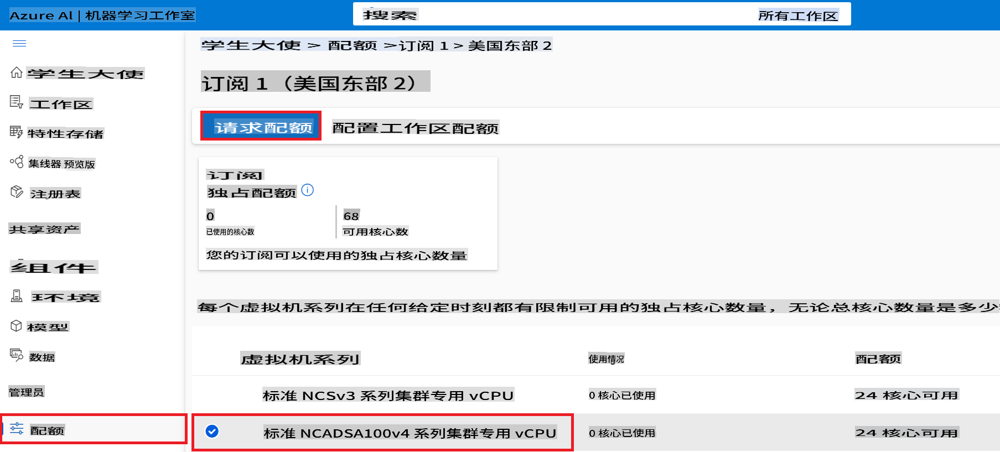
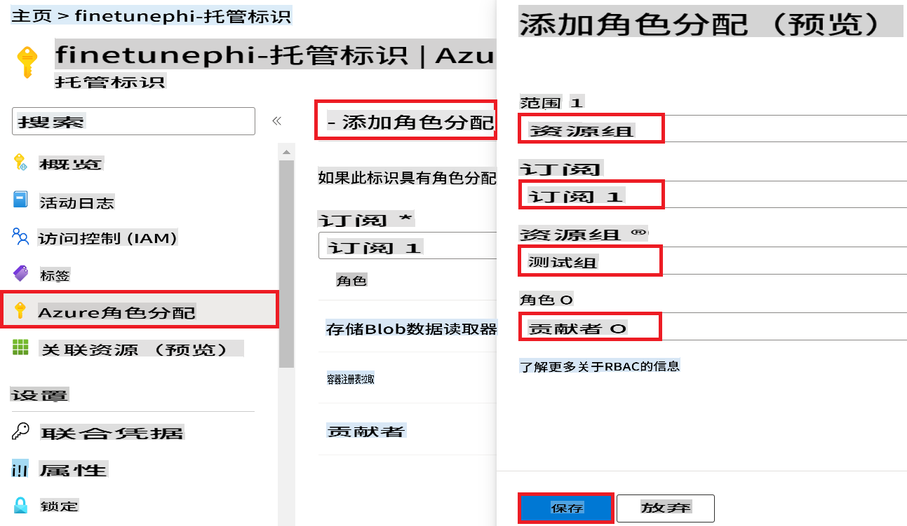
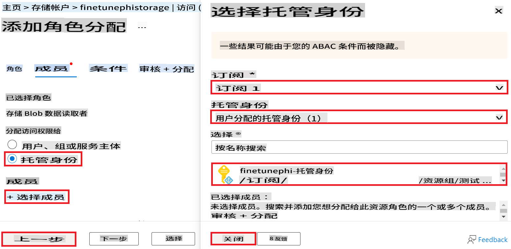
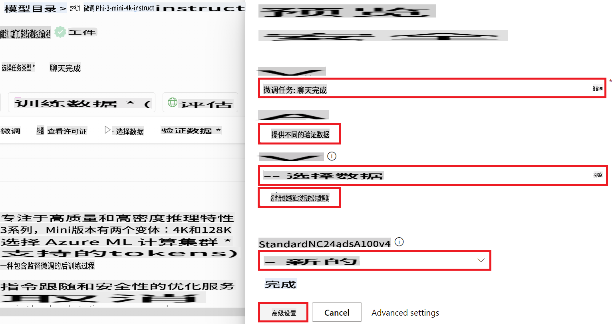
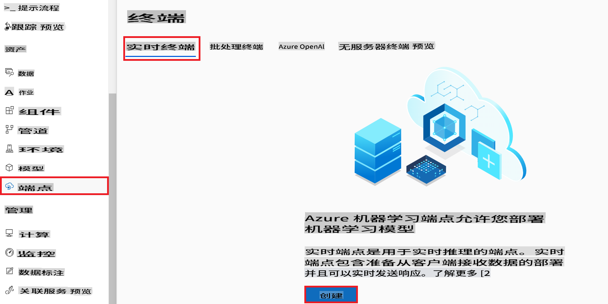
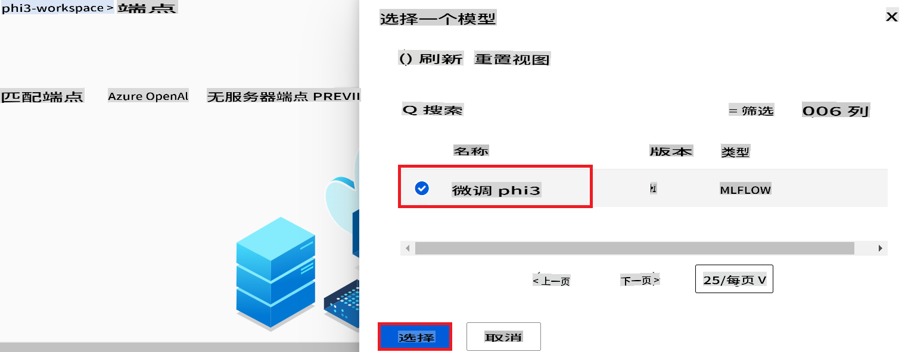
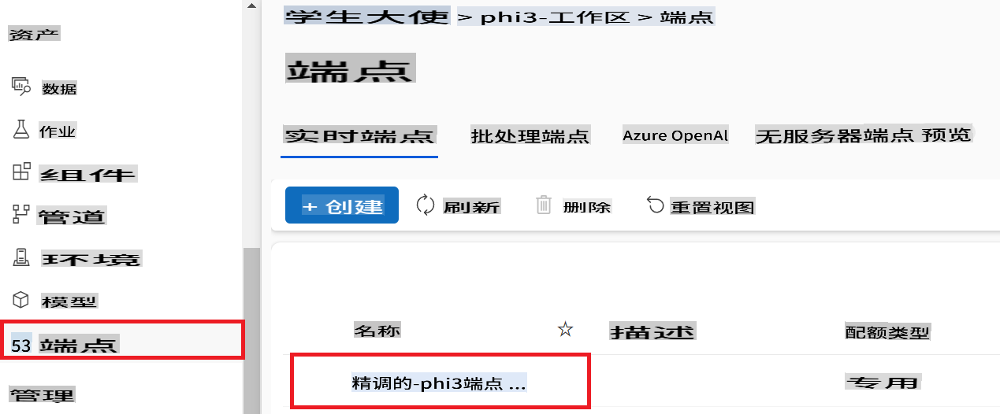
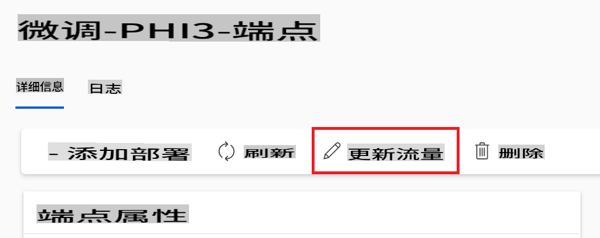
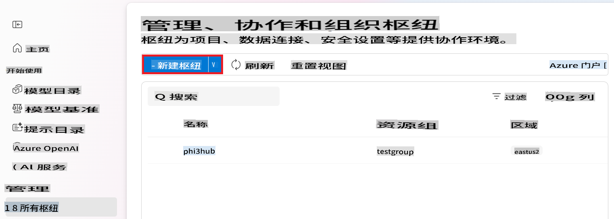
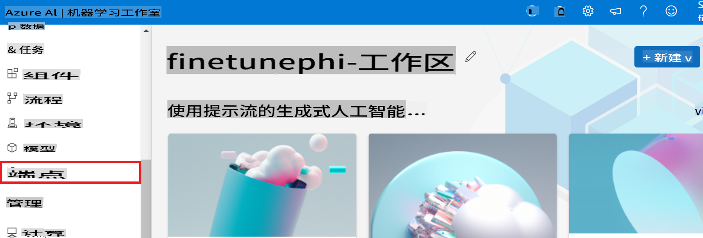

# 微调和集成自定义 Phi-3 模型与 Azure AI Studio 中的 Prompt flow

这个端到端 (E2E) 示例基于 Microsoft 技术社区的指南“[Fine-Tune and Integrate Custom Phi-3 Models with Prompt Flow in Azure AI Studio](https://techcommunity.microsoft.com/t5/educator-developer-blog/fine-tune-and-integrate-custom-phi-3-models-with-prompt-flow-in/ba-p/4191726?WT.mc_id=aiml-137032-kinfeylo)”。它介绍了在 Azure AI Studio 中微调、部署和集成自定义 Phi-3 模型与 Prompt flow 的过程。
与端到端示例“[Fine-Tune and Integrate Custom Phi-3 Models with Prompt Flow](./E2E_Phi-3-FineTuning_PromptFlow_Integration.md)”不同，该教程完全聚焦于在 Azure AI / ML Studio 内部微调和集成你的模型。

## 概述

在这个端到端示例中，你将学习如何微调 Phi-3 模型并将其与 Azure AI Studio 中的 Prompt flow 集成。通过利用 Azure AI / ML Studio，你将建立一个部署和使用自定义 AI 模型的工作流程。这个端到端示例分为三个场景：

**场景 1：设置 Azure 资源并为微调做准备**

**场景 2：微调 Phi-3 模型并在 Azure Machine Learning Studio 中部署**

**场景 3：与 Prompt flow 集成并在 Azure AI Studio 中与自定义模型聊天**

以下是这个端到端示例的概述。


### 目录

1. **[场景 1：设置 Azure 资源并为微调做准备](../../../../md/06.E2ESamples)**
    - [创建 Azure Machine Learning 工作区](../../../../md/06.E2ESamples)
    - [在 Azure 订阅中请求 GPU 配额](../../../../md/06.E2ESamples)
    - [添加角色分配](../../../../md/06.E2ESamples)
    - [设置项目](../../../../md/06.E2ESamples)
    - [准备微调数据集](../../../../md/06.E2ESamples)

1. **[场景 2：微调 Phi-3 模型并在 Azure Machine Learning Studio 中部署](../../../../md/06.E2ESamples)**
    - [微调 Phi-3 模型](../../../../md/06.E2ESamples)
    - [部署微调后的 Phi-3 模型](../../../../md/06.E2ESamples)

1. **[场景 3：与 Prompt flow 集成并在 Azure AI Studio 中与自定义模型聊天](../../../../md/06.E2ESamples)**
    - [将自定义 Phi-3 模型与 Prompt flow 集成](../../../../md/06.E2ESamples)
    - [与自定义 Phi-3 模型聊天](../../../../md/06.E2ESamples)

## 场景 1：设置 Azure 资源并为微调做准备

### 创建 Azure Machine Learning 工作区

1. 在门户页面顶部的**搜索栏**中输入 *azure machine learning*，然后从出现的选项中选择 **Azure Machine Learning**。

    

2. 从导航菜单中选择 **+ 创建**。

3. 从导航菜单中选择 **新建工作区**。

    

4. 执行以下任务：

    - 选择你的 Azure **订阅**。
    - 选择要使用的**资源组**（如果需要，可创建一个新的）。
    - 输入**工作区名称**。它必须是一个唯一值。
    - 选择你想使用的**区域**。
    - 选择要使用的**存储账户**（如果需要，可创建一个新的）。
    - 选择要使用的**密钥保管库**（如果需要，可创建一个新的）。
    - 选择要使用的**应用程序洞察**（如果需要，可创建一个新的）。
    - 选择要使用的**容器注册表**（如果需要，可创建一个新的）。

    

5. 选择 **审核 + 创建**。

6. 选择 **创建**。

### 在 Azure 订阅中请求 GPU 配额

在本教程中，你将学习如何使用 GPU 微调和部署 Phi-3 模型。对于微调，你将使用 *Standard_NC24ads_A100_v4* GPU，这需要一个配额请求。对于部署，你将使用 *Standard_NC6s_v3* GPU，这也需要一个配额请求。

> [!NOTE]
>
> 只有按需付费订阅（标准订阅类型）有资格分配 GPU；目前不支持福利订阅。
>

1. 访问 [Azure ML Studio](https://ml.azure.com/home?wt.mc_id=studentamb_279723)。

1. 执行以下任务以请求 *Standard NCADSA100v4 Family* 配额：

    - 从左侧选项卡中选择 **配额**。
    - 选择要使用的**虚拟机系列**。例如，选择 **Standard NCADSA100v4 Family Cluster Dedicated vCPUs**，其中包括 *Standard_NC24ads_A100_v4* GPU。
    - 从导航菜单中选择 **请求配额**。

        

    - 在请求配额页面中，输入你想使用的**新核心限制**。例如，24。
    - 在请求配额页面中，选择 **提交** 以请求 GPU 配额。

1. 执行以下任务以请求 *Standard NCSv3 Family* 配额：

    - 从左侧选项卡中选择 **配额**。
    - 选择要使用的**虚拟机系列**。例如，选择 **Standard NCSv3 Family Cluster Dedicated vCPUs**，其中包括 *Standard_NC6s_v3* GPU。
    - 从导航菜单中选择 **请求配额**。
    - 在请求配额页面中，输入你想使用的**新核心限制**。例如，24。
    - 在请求配额页面中，选择 **提交** 以请求 GPU 配额。

### 添加角色分配

要微调和部署你的模型，首先必须创建一个用户分配的托管身份 (UAI) 并赋予其适当的权限。此 UAI 将用于部署期间的身份验证。

#### 创建用户分配的托管身份 (UAI)

1. 在门户页面顶部的**搜索栏**中输入 *managed identities*，然后从出现的选项中选择 **Managed Identities**。

    

1. 选择 **+ 创建**。

    

1. 执行以下任务：

    - 选择你的 Azure **订阅**。
    - 选择要使用的**资源组**（如果需要，可创建一个新的）。
    - 选择你想使用的**区域**。
    - 输入**名称**。它必须是一个唯一值。

    

1. 选择 **审核 + 创建**。

1. 选择 **+ 创建**。

#### 为托管身份添加贡献者角色分配

1. 导航到你创建的托管身份资源。

1. 从左侧选项卡中选择 **Azure 角色分配**。

1. 从导航菜单中选择 **+ 添加角色分配**。

1. 在添加角色分配页面中，执行以下任务：
    - 选择**范围**为**资源组**。
    - 选择你的 Azure **订阅**。
    - 选择要使用的**资源组**。
    - 选择**角色**为**贡献者**。

    

1. 选择 **保存**。

#### 为托管身份添加存储 Blob 数据读取者角色分配

1. 在门户页面顶部的**搜索栏**中输入 *storage accounts*，然后从出现的选项中选择 **Storage accounts**。

    

1. 选择与你创建的 Azure Machine Learning 工作区关联的存储账户。例如，*finetunephistorage*。

1. 执行以下任务以导航到添加角色分配页面：

    - 导航到你创建的 Azure 存储账户。
    - 从左侧选项卡中选择 **访问控制 (IAM)**。
    - 从导航菜单中选择 **+ 添加**。
    - 从导航菜单中选择 **添加角色分配**。

    

1. 在添加角色分配页面中，执行以下任务：

    - 在角色页面中，在**搜索栏**中输入 *Storage Blob Data Reader* 并从出现的选项中选择 **Storage Blob Data Reader**。
    - 在角色页面中选择 **下一步**。
    - 在成员页面中选择**分配访问给** **托管身份**。
    - 在成员页面中选择 **+ 选择成员**。
    - 在选择托管身份页面中，选择你的 Azure **订阅**。
    - 在选择托管身份页面中，选择**托管身份**为**托管身份**。
    - 在选择托管身份页面中，选择你创建的托管身份。例如，*finetunephi-managedidentity*。
    - 在选择托管身份页面中选择 **选择**。

    

1. 选择 **审核 + 分配**。

#### 为托管身份添加 AcrPull 角色分配

1. 在门户页面顶部的**搜索栏**中输入 *container registries*，然后从出现的选项中选择 **Container registries**。

    

1. 选择与你的 Azure Machine Learning 工作区关联的容器注册表。例如，*finetunephicontainerregistry*。

1. 执行以下任务以导航到添加角色分配页面：

    - 从左侧选项卡中选择 **访问控制 (IAM)**。
    - 从导航菜单中选择 **+ 添加**。
    - 从导航菜单中选择 **添加角色分配**。

1. 在添加角色分配页面中，执行以下任务：

    - 在角色页面中，在**搜索栏**中输入 *AcrPull* 并从出现的选项中选择 **AcrPull**。
    - 在角色页面中选择 **下一步**。
    - 在成员页面中选择**分配访问给** **托管身份**。
    - 在成员页面中选择 **+ 选择成员**。
    - 在选择托管身份页面中，选择你的 Azure **订阅**。
    - 在选择托管身份页面中，选择**托管身份**为**托管身份**。
    - 在选择托管身份页面中，选择你创建的托管身份。例如，*finetunephi-managedidentity*。
    - 在选择托管身份页面中选择 **选择**。
    - 选择 **审核 + 分配**。

### 设置项目

为了下载微调所需的数据集，你将设置一个本地环境。

在本练习中，你将：

- 创建一个文件夹在其中工作。
- 创建一个虚拟环境。
- 安装所需的包。
- 创建一个 *download_dataset.py* 文件来下载数据集。

#### 创建一个文件夹在其中工作

1. 打开终端窗口，输入以下命令在默认路径中创建一个名为 *finetune-phi* 的文件夹。

    ```console
    mkdir finetune-phi
    ```

2. 在终端中输入以下命令导航到你创建的 *finetune-phi* 文件夹。

    ```console
    cd finetune-phi
    ```

#### 创建一个虚拟环境

1. 在终端中输入以下命令创建一个名为 *.venv* 的虚拟环境。

    ```console
    python -m venv .venv
    ```

2. 在终端中输入以下命令激活虚拟环境。

    ```console
    .venv\Scripts\activate.bat
    ```

> [!NOTE]
> 如果成功，你应该会看到命令提示符前有 *(.venv)*。

#### 安装所需的包

1. 在终端中输入以下命令安装所需的包。

    ```console
    pip install datasets==2.19.1
    ```

#### 创建 `download_dataset.py`

> [!NOTE]
> 完整的文件夹结构：
>
> ```text
> └── YourUserName
> .    └── finetune-phi
> .        └── download_dataset.py
> ```

1. 打开 **Visual Studio Code**。

1. 从菜单栏中选择 **文件**。

1. 选择 **打开文件夹**。

1. 选择你创建的 *finetune-phi* 文件夹，路径为 *C:\Users\yourUserName\finetune-phi*。

    

1. 在 Visual Studio Code 的左侧窗格中，右键选择 **新建文件** 来创建一个名为 *download_dataset.py* 的新文件。

    

### 准备微调数据集

在本练习中，你将运行 *download_dataset.py* 文件，将 *ultrachat_200k* 数据集下载到本地环境。然后，你将使用这些数据集在 Azure Machine Learning 中微调 Phi-3 模型。

在本练习中，你将：

- 向 *download_dataset.py* 文件添加代码以下载数据集。
- 运行 *download_dataset.py* 文件将数据集下载到本地环境。

#### 使用 *download_dataset.py* 下载你的数据集

1. 在 Visual Studio Code 中打开 *download_dataset.py* 文件。

1. 将以下代码添加到 *download_dataset.py* 文件中。

    ```python
    import json
    import os
    from datasets import load_dataset

    def load_and_split_dataset(dataset_name, config_name, split_ratio):
        """
        加载并拆分数据集。
        """
        # 使用指定的名称、配置和拆分比例加载数据集
        dataset = load_dataset(dataset_name, config_name, split=split_ratio)
        print(f"原始数据集大小: {len(dataset)}")
        
        # 将数据集拆分为训练集和测试集（80% 训练，20% 测试）
        split_dataset = dataset.train_test_split(test_size=0.2)
        print(f"训练数据集大小: {len(split_dataset['train'])}")
        print(f"测试数据集大小: {len(split_dataset['test'])}")
        
        return split_dataset

    def save_dataset_to_jsonl(dataset, filepath):
        """
        将数据集保存到 JSONL 文件。
        """
        # 如果目录不存在，则创建目录
        os.makedirs(os.path.dirname(filepath), exist_ok=True)
        
        # 以写模式打开文件
        with open(filepath, 'w', encoding='utf-8') as f:
            # 遍历数据集中的每条记录
            for record in dataset:
                # 将记录作为 JSON 对象写入文件
                json.dump(record, f)
                # 写入换行符以分隔记录
                f.write('\n')
        
        print(f"数据集已保存到 {filepath}")

    def main():
        """
        加载、拆分和保存数据集的主函数。
        """
        # 使用特定配置和拆分比例加载和拆分 ULTRACHAT_200k 数据集
        dataset = load_and_split_dataset("HuggingFaceH4/ultrachat_200k", 'default', 'train_sft[:1%]')
        
        # 从拆分中提取训练集和测试集
        train_dataset = dataset['train']
        test_dataset = dataset['test']

        # 将训练数据集保存到 JSONL 文件
        save_dataset_to_jsonl(train_dataset, "data/train_data.jsonl")
        
        # 将测试数据集保存到单独的 JSONL 文件
        save_dataset_to_jsonl(test_dataset, "data/test_data.jsonl")

    if __name__ == "__main__":
        main()

    ```

1. 在终端中输入以下命令运行脚本并将数据集下载到本地环境。

    ```console
    python download_dataset.py
    ```

1. 验证数据集是否成功保存到本地 *finetune-phi/data* 目录中。

> [!NOTE]
>
> #### 关于数据集大小和微调时间的说明
>
> 在本教程中，你只使用数据集的 1% (`split='train[:1%]'`)。这大大减少了数据量，加快了上传和微调过程。你可以调整百分比以找到训练时间和模型性能之间的最佳平衡。使用较小的数据集子集可以减少微调所
1. 访问 [Azure ML Studio](https://ml.azure.com/home?wt.mc_id=studentamb_279723)。

1. 从左侧标签中选择 **Compute**。

1. 从导航菜单中选择 **Compute clusters**。

1. 选择 **+ New**。

    

1. 执行以下任务：

    - 选择你想使用的 **Region**。
    - 将 **Virtual machine tier** 选择为 **Dedicated**。
    - 将 **Virtual machine type** 选择为 **GPU**。
    - 将 **Virtual machine size** 筛选器选择为 **Select from all options**。
    - 将 **Virtual machine size** 选择为 **Standard_NC24ads_A100_v4**。

    

1. 选择 **Next**。

1. 执行以下任务：

    - 输入 **Compute name**。它必须是一个唯一值。
    - 将 **Minimum number of nodes** 选择为 **0**。
    - 将 **Maximum number of nodes** 选择为 **1**。
    - 将 **Idle seconds before scale down** 选择为 **120**。

    

1. 选择 **Create**。

#### 微调 Phi-3 模型

1. 访问 [Azure ML Studio](https://ml.azure.com/home?wt.mc_id=studentamb_279723)。

1. 选择你创建的 Azure Machine Learning 工作区。

    

1. 执行以下任务：

    - 从左侧标签中选择 **Model catalog**。
    - 在 **搜索栏** 中输入 *phi-3-mini-4k*，然后从出现的选项中选择 **Phi-3-mini-4k-instruct**。

    

1. 从导航菜单中选择 **Fine-tune**。

    

1. 执行以下任务：

    - 将 **Select task type** 选择为 **Chat completion**。
    - 选择 **+ Select data** 上传 **Training data**。
    - 将验证数据上传类型选择为 **Provide different validation data**。
    - 选择 **+ Select data** 上传 **Validation data**。

    

    > [!TIP]
    >
    > 你可以选择 **Advanced settings** 自定义配置，如 **learning_rate** 和 **lr_scheduler_type**，以根据你的具体需求优化微调过程。

1. 选择 **Finish**。

1. 在此练习中，你成功使用 Azure Machine Learning 微调了 Phi-3 模型。请注意，微调过程可能需要相当长的时间。运行微调任务后，你需要等待其完成。你可以通过导航到 Azure Machine Learning 工作区左侧的 Jobs 标签来监控微调任务的状态。在下一系列中，你将部署微调后的模型并将其与 Prompt flow 集成。

    

### 部署微调后的 Phi-3 模型

要将微调后的 Phi-3 模型与 Prompt flow 集成，你需要部署模型以使其可用于实时推理。此过程涉及注册模型、创建在线端点并部署模型。

在此练习中，你将：

- 在 Azure Machine Learning 工作区中注册微调后的模型。
- 创建在线端点。
- 部署注册的微调后的 Phi-3 模型。

#### 注册微调后的模型

1. 访问 [Azure ML Studio](https://ml.azure.com/home?wt.mc_id=studentamb_279723)。

1. 选择你创建的 Azure Machine Learning 工作区。

    

1. 从左侧标签中选择 **Models**。
1. 选择 **+ Register**。
1. 选择 **From a job output**。

    

1. 选择你创建的任务。

    

1. 选择 **Next**。

1. 将 **Model type** 选择为 **MLflow**。

1. 确保选择了 **Job output**；它应该是自动选择的。

    

1. 选择 **Next**。

1. 选择 **Register**。

    

1. 你可以通过导航到左侧标签中的 **Models** 菜单来查看已注册的模型。

    

#### 部署微调后的模型

1. 导航到你创建的 Azure Machine Learning 工作区。

1. 从左侧标签中选择 **Endpoints**。

1. 从导航菜单中选择 **Real-time endpoints**。

    

1. 选择 **Create**。

1. 选择你创建的已注册模型。

    

1. 选择 **Select**。

1. 执行以下任务：

    - 将 **Virtual machine** 选择为 *Standard_NC6s_v3*。
    - 选择你想使用的 **Instance count**。例如，*1*。
    - 将 **Endpoint** 选择为 **New** 以创建一个端点。
    - 输入 **Endpoint name**。它必须是一个唯一值。
    - 输入 **Deployment name**。它必须是一个唯一值。

    

1. 选择 **Deploy**。

> [!WARNING]
> 为了避免你的账户产生额外费用，请确保删除在 Azure Machine Learning 工作区中创建的端点。
>

#### 在 Azure Machine Learning 工作区中检查部署状态

1. 导航到你创建的 Azure Machine Learning 工作区。

1. 从左侧标签中选择 **Endpoints**。

1. 选择你创建的端点。

    

1. 在此页面上，你可以在部署过程中管理端点。

> [!NOTE]
> 部署完成后，确保 **Live traffic** 设置为 **100%**。如果不是，请选择 **Update traffic** 以调整流量设置。请注意，如果流量设置为 0%，你将无法测试模型。
>
> 
>

## 场景 3：在 Azure AI Studio 中与 Prompt flow 和你的自定义模型聊天

### 将自定义 Phi-3 模型与 Prompt flow 集成

成功部署微调后的模型后，你现在可以将其与 Prompt Flow 集成，以便在实时应用中使用你的模型，从而启用与自定义 Phi-3 模型的各种交互任务。

在此练习中，你将：

- 创建 Azure AI Studio Hub。
- 创建 Azure AI Studio Project。
- 创建 Prompt flow。
- 为微调后的 Phi-3 模型添加自定义连接。
- 设置 Prompt flow 与你的自定义 Phi-3 模型进行聊天。

> [!NOTE]
> 你也可以使用 Azure ML Studio 与 Promptflow 集成。相同的集成过程可以应用于 Azure ML Studio。

#### 创建 Azure AI Studio Hub

在创建 Project 之前，你需要创建一个 Hub。Hub 类似于资源组，允许你在 Azure AI Studio 中组织和管理多个 Project。

1. 访问 [Azure AI Studio](https://ai.azure.com/?WT.mc_id=aiml-137032-kinfeylo)。

1. 从左侧标签中选择 **All hubs**。

1. 从导航菜单中选择 **+ New hub**。

    

1. 执行以下任务：

    - 输入 **Hub name**。它必须是一个唯一值。
    - 选择你的 Azure **Subscription**。
    - 选择要使用的 **Resource group**（如有需要，创建一个新的）。
    - 选择你想使用的 **Location**。
    - 选择要使用的 **Connect Azure AI Services**（如有需要，创建一个新的）。
    - 将 **Connect Azure AI Search** 选择为 **Skip connecting**。

    

1. 选择 **Next**。

#### 创建 Azure AI Studio Project

1. 在你创建的 Hub 中，从左侧标签中选择 **All projects**。

1. 从导航菜单中选择 **+ New project**。

    

1. 输入 **Project name**。它必须是一个唯一值。

    

1. 选择 **Create a project**。

#### 为微调后的 Phi-3 模型添加自定义连接

要将你的自定义 Phi-3 模型与 Prompt flow 集成，你需要在自定义连接中保存模型的端点和密钥。此设置确保在 Prompt flow 中访问你的自定义 Phi-3 模型。

#### 设置微调后的 Phi-3 模型的 API 密钥和端点 URI

1. 访问 [Azure ML Studio](https://ml.azure.com/home?WT.mc_id=aiml-137032-kinfeylo)。

1. 导航到你创建的 Azure Machine Learning 工作区。

1. 从左侧标签中选择 **Endpoints**。

    

1. 选择你创建的端点。

    

1. 从导航菜单中选择 **Consume**。

1. 复制你的 **REST endpoint** 和 **Primary key**。


免责声明：此翻译由AI模型从原文翻译而来，可能不完美。请审阅输出并进行任何必要的修改。