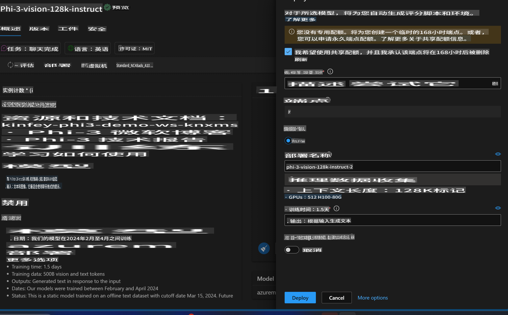

# **实验3 - 在Azure机器学习服务上部署Phi-3-vision**

我们使用NPU完成本地代码的生产部署，然后我们希望通过它引入PHI-3-VISION的能力，实现图片生成代码。

在本介绍中，我们可以快速在Azure机器学习服务中构建一个模型即服务Phi-3 Vision服务。

***注意***： Phi-3 Vision需要计算能力来更快地生成内容。我们需要云计算能力来帮助我们实现这一点。

### **1. 创建Azure机器学习服务**

我们需要在Azure门户中创建一个Azure机器学习服务。如果你想了解如何创建，请访问这个链接 [https://learn.microsoft.com/azure/machine-learning/quickstart-create-resources?view=azureml-api-2](https://learn.microsoft.com/azure/machine-learning/quickstart-create-resources?view=azureml-api-2)

### **2. 在Azure机器学习服务中选择Phi-3 Vision**


### **3. 在Azure中部署Phi-3-Vision**



### **4. 在Postman中测试端点**


***注意***

1. 传递的参数必须包括Authorization、azureml-model-deployment和Content-Type。你需要检查部署信息以获取这些参数。

2. 传递参数时，Phi-3-Vision需要传递一个图片链接。请参考GPT-4-Vision的方法传递参数，例如

```json

{
  "input_data":{
    "input_string":[
      {
        "role":"user",
        "content":[ 
          {
            "type": "text",
            "text": "You are a Python coding assistant.Please create Python code for image "
          },
          {
              "type": "image_url",
              "image_url": {
                "url": "https://ajaytech.co/wp-content/uploads/2019/09/index.png"
              }
          }
        ]
      }
    ],
    "parameters":{
          "temperature": 0.6,
          "top_p": 0.9,
          "do_sample": false,
          "max_new_tokens": 2048
    }
  }
}

```

3. 使用Post方法调用 **/score**

**恭喜你** ！你已经完成了快速的PHI-3-VISION部署，并尝试了如何使用图片生成代码。接下来，我们可以结合NPU和云构建应用程序。

免责声明：此翻译由人工智能模型从原文翻译而来，可能并不完美。请检查输出并进行必要的修正。