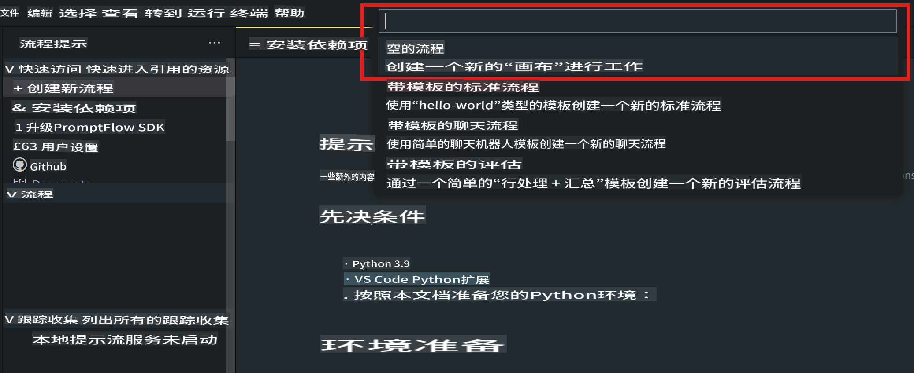

# **实验2 - 在AIPC中运行Phi-3-mini的Prompt flow**

## **什么是Prompt flow**

Prompt flow是一套开发工具，旨在简化基于LLM的AI应用程序的端到端开发周期，从构思、原型设计、测试、评估到生产部署和监控。它使得提示工程变得更加容易，并使您能够构建具有生产质量的LLM应用程序。

通过prompt flow，您将能够：

- 创建将LLM、提示、Python代码和其他工具链接在一起的可执行工作流。

- 轻松调试和迭代您的工作流，特别是与LLM的交互。

- 评估您的工作流，使用更大的数据集计算质量和性能指标。

- 将测试和评估集成到您的CI/CD系统中，以确保工作流的质量。

- 将您的工作流部署到您选择的服务平台或轻松集成到您的应用程序代码库中。

- （可选但强烈推荐）通过在Azure AI中利用Prompt flow的云版本与您的团队协作。


## **在Apple Silicon上构建生成代码的工作流**

***注意*** ：如果您尚未完成环境安装，请访问[实验0 - 安装](./01.Installations.md)

1. 在Visual Studio Code中打开Prompt flow扩展并创建一个空的工作流项目



2. 添加输入和输出参数，并添加Python代码作为新的工作流


您可以参考这个结构（flow.dag.yaml）来构建您的工作流

```yaml

inputs:
  prompt:
    type: string
    default: Write python code for Fibonacci serie. Please use markdown as output
outputs:
  result:
    type: string
    reference: ${gen_code_by_phi3.output}
nodes:
- name: gen_code_by_phi3
  type: python
  source:
    type: code
    path: gen_code_by_phi3.py
  inputs:
    prompt: ${inputs.prompt}


```

3. 量化phi-3-mini

我们希望在本地设备上更好地运行SLM。通常，我们会量化模型（INT4, FP16, FP32）


```bash

python -m mlx_lm.convert --hf-path microsoft/Phi-3-mini-4k-instruct

```

**注意：** 默认文件夹是mlx_model 

4. 在***Chat_With_Phi3.py***中添加代码


```python


from promptflow import tool

from mlx_lm import load, generate


# 输入部分将根据工具函数的参数变化，在保存代码后
# 为参数和返回值添加类型将帮助系统正确显示类型
# 请根据需要更新函数名称/签名
@tool
def my_python_tool(prompt: str) -> str:

    model_id = './mlx_model_phi3_mini'

    model, tokenizer = load(model_id)

    # <|user|>\nWrite python code for Fibonacci serie. Please use markdown as output<|end|>\n<|assistant|>

    response = generate(model, tokenizer, prompt="<|user|>\n" + prompt  + "<|end|>\n<|assistant|>", max_tokens=2048, verbose=True)

    return response


```

4. 您可以通过调试或运行来测试工作流，检查生成代码是否正确


5. 在终端中以开发API运行工作流

```

pf flow serve --source ./ --port 8080 --host localhost   

```

您可以在Postman / Thunder Client中测试它


### **注意**

1. 第一次运行需要很长时间。建议从Hugging face CLI下载phi-3模型。

2. 考虑到Intel NPU的计算能力有限，建议使用Phi-3-mini-4k-instruct

3. 我们使用Intel NPU加速量化INT4转换，但如果重新运行服务，需要删除缓存和nc_workshop文件夹。


## **资源**

1. 学习Promptflow [https://microsoft.github.io/promptflow/](https://microsoft.github.io/promptflow/)

2. 学习Intel NPU加速 [https://github.com/intel/intel-npu-acceleration-library](https://github.com/intel/intel-npu-acceleration-library)

3. 示例代码，下载[本地NPU代理示例代码](../../../../../../../code/07.Lab/01/AIPC/local-npu-agent)

免责声明：本翻译由AI模型从原文翻译而来，可能不够完美。请审阅输出内容并进行必要的修改。